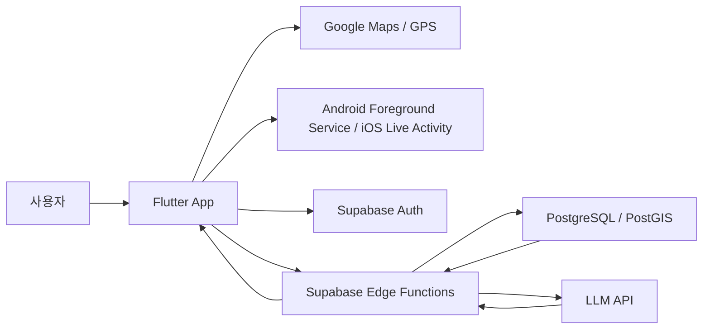
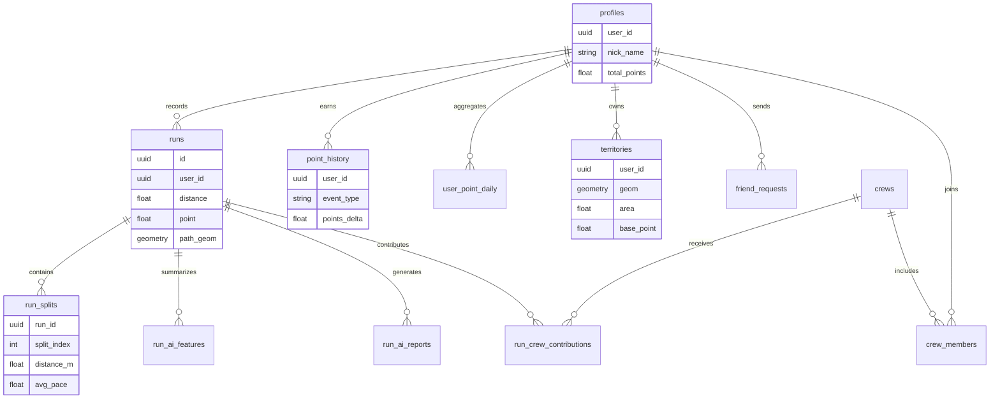
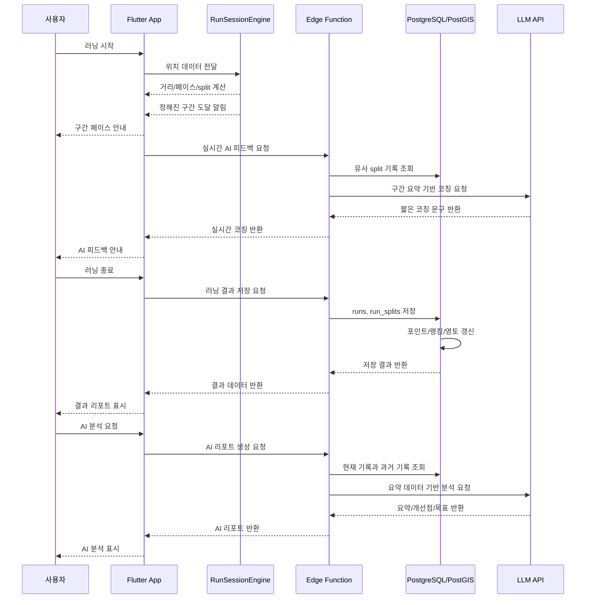

# Runner.io 최종 결과 보고서

3분반 1조

팀원: 권민지(202133304), 송영우(202135546), 최윤영(202336133)

## 1. 프로젝트 배경

### 1.1 러닝과 운동 지속성 문제

최근 건강관리와 개인 운동에 대한 관심이 높아지면서 러닝은 누구나 쉽게 시작할 수 있는 대표적인 생활 운동이 되었다. 러닝은 특별한 장비가 없어도 시작할 수 있고, 사용자가 자신의 체력과 일정에 맞춰 자유롭게 운동 강도를 조절할 수 있다는 장점이 있다. 학교 주변, 집 근처, 공원, 산책로처럼 일상 공간을 활용할 수 있다는 점도 러닝의 장점이다.

그러나 러닝을 시작하는 것과 꾸준히 이어가는 것은 다른 문제이다. 많은 사용자가 처음에는 운동 기록을 확인하는 데 흥미를 느끼지만, 시간이 지나면서 거리, 시간, 페이스, 칼로리 같은 숫자만으로는 충분한 동기부여를 얻지 못한다. 특히 초보 러너는 자신의 기록이 좋은지 나쁜지 판단하기 어렵고, 다음 운동에서 무엇을 개선해야 하는지도 쉽게 알기 어렵다.

기존 러닝 앱은 대부분 운동 기록 측정과 통계 제공에 강점을 가진다. 사용자는 러닝을 끝낸 뒤 거리, 시간, 평균 페이스, 경로 등을 확인할 수 있다. 이러한 기능은 운동을 객관적으로 기록하는 데 매우 유용하다. 하지만 기록을 확인하는 경험이 반복되면 사용자는 앱에서 새로운 재미를 느끼기 어렵다. 기록이 조금씩 좋아지는 사용자는 성취감을 얻을 수 있지만, 초보자나 라이트 사용자는 기록 향상이 뚜렷하지 않을 때 쉽게 흥미를 잃을 수 있다.

Runner.io는 이 지점에서 출발하였다. 러닝 기록을 단순한 숫자로만 보여주는 대신, 사용자가 달린 경로를 지도 위의 시각적 성취로 바꾸고, 그 결과를 포인트, 랭킹, 영토, 친구/크루 참여, AI 피드백으로 연결하면 운동을 더 재미있게 이어갈 수 있을 것이라고 보았다.

### 1.2 기존 러닝 앱의 한계

기존 러닝 앱은 러닝 기록을 정확하게 측정하고, 운동 결과를 체계적으로 보여주는 데 강점이 있다. 하지만 기록이 거리, 시간, 페이스 같은 숫자 중심으로 표현되면 초보자에게는 다소 건조하게 느껴질 수 있다. Runner.io는 이 한계를 줄이기 위해 기록을 지도 경로, 영토, 포인트 같은 시각적 성취로 바꾸고자 했다.

또한 기존 앱의 동기부여는 개인 기록 향상에 의존하는 경우가 많다. 숙련자는 기록이 조금씩 좋아지는 과정에서 재미를 느낄 수 있지만, 초보 사용자는 기록 향상이 뚜렷하지 않을 때 쉽게 지칠 수 있다. Runner.io는 포인트, 랭킹, 배지, 친구/크루 참여를 통해 사용자가 기록 외에도 다양한 방식으로 성취를 확인할 수 있도록 설계하였다.

초보자 지원 측면에서도 보완이 필요하다고 보았다. 기록을 확인하더라도 사용자가 그 의미를 이해하지 못하면 다음 운동 목표를 세우기 어렵다. 따라서 AI 리포트와 러닝 중 실시간 피드백을 통해 수치 기록을 문장형 해석으로 바꾸고, 사용자가 자신의 페이스와 개선 방향을 더 쉽게 이해하도록 돕고자 했다.

기록 중심의 앱은 숙련자에게는 효과적일 수 있다. 그러나 운동을 막 시작한 사용자는 자신의 기록을 보고도 "잘하고 있는지", "다음에는 무엇을 목표로 해야 하는지"를 알기 어렵다. 따라서 초보 사용자에게는 기록을 해석해 주는 장치와 운동을 이어가고 싶게 만드는 구조가 필요하다.

### 1.3 프로젝트 문제 정의

본 프로젝트에서 정의한 문제는 다음과 같다.

1. 러닝 기록이 숫자 중심으로 표현되어 초보 사용자에게 성취감이 약할 수 있다.
2. 운동 결과가 다음 운동으로 이어지는 반복 구조가 부족하다.
3. GPS 경로 데이터가 단순 경로 표시로만 사용되어 공간적 재미가 충분히 활용되지 않는다.
4. 사용자가 자신의 기록을 이해하고 개선 방향을 잡는 데 어려움을 느낄 수 있다.
5. 개인 운동 경험이 친구나 소규모 그룹 참여로 자연스럽게 확장되기 어렵다.

Runner.io는 이 문제를 해결하기 위해 GPS 기반 러닝 기록에 게임화 요소와 AI 피드백을 결합하였다. 사용자가 러닝을 하면 경로가 기록되고, 그 결과가 포인트와 랭킹에 반영되며, 지도 위의 영토로 표현된다. 또한 친구와 크루 기능을 통해 개인 기록을 다른 사용자와 비교하거나 함께 참여하는 흐름으로 확장할 수 있도록 하였다.

---

## 2. 프로젝트 개요 및 개발 목표

### 2.1 프로젝트 개요

Runner.io는 Flutter 기반의 크로스플랫폼 러닝 애플리케이션이다. 사용자는 앱에 로그인한 뒤 지도 화면에서 러닝을 시작할 수 있다. 앱은 GPS 위치 정보를 수집하여 사용자의 이동 경로를 지도 위에 표시하고, 거리, 시간, 페이스, 구간 기록, 상승고도 등의 운동 지표를 계산한다.

러닝이 종료되면 결과는 Supabase Edge Function을 통해 서버에 저장된다. 저장된 기록은 결과 리포트, 러닝 기록 화면, 분석 화면, 포인트 이력, 랭킹, 영토 상세 화면에 반영된다. 사용자는 자신의 운동 결과를 다양한 방식으로 확인할 수 있으며, 운동 후에는 AI 리포트를 통해 요약, 개선점, 다음 목표, 코칭 문구를 확인할 수 있다.

프로젝트의 핵심 경험은 "Run and Conquer your territory"이다. 사용자가 달린 만큼 지도 위의 경로와 영토가 확장되고, 그 결과가 포인트와 랭킹으로 이어진다. 이 문구는 러닝 기록이 단순 데이터가 아니라 사용자의 활동 영역과 성취로 남는다는 의미를 담고 있다.

### 2.2 핵심 로직

Runner.io의 핵심 로직은 사용자가 러닝을 완료했을 때 운동 결과가 여러 게임화 요소로 동시에 반영되는 구조이다. 사용자가 러닝을 시작하면 앱은 GPS 위치를 일정 간격으로 수집하고, 이 위치들을 이어 경로를 만든다. 러닝이 끝나면 앱은 총 거리, 운동 시간, 평균 속도, 평균 페이스, 구간 기록, 경로 데이터를 계산하여 서버에 저장한다. 이때 사용자는 단순히 "몇 km를 달렸다"는 기록만 얻는 것이 아니라, 포인트, 영토, 랭킹, 기록 분석으로 이어지는 결과를 함께 얻는다.

포인트는 크게 두 가지 흐름으로 쌓인다. 첫 번째는 러닝 완료 포인트이다. 앱은 사용자가 달린 거리와 평균 속도를 바탕으로 러닝 포인트를 계산한다. 긴 거리를 달릴수록 기본 포인트가 증가하고, 같은 거리라도 더 좋은 속도로 달리면 조금 더 높은 점수를 받을 수 있도록 구성하였다. 이 방식은 무조건 빠른 사용자만 유리하게 만들기보다, 실제로 운동을 완료한 활동량을 중심으로 보상하기 위한 것이다. 러닝이 서버에 저장되면 해당 포인트는 포인트 이력에 기록되고, 사용자의 누적 포인트와 일별 포인트 집계에도 반영된다.

두 번째는 영토와 연결된 포인트이다. 사용자의 GPS 경로는 지도 위의 선으로만 남는 것이 아니라, PostGIS를 통해 면적을 가진 영토 데이터로 변환된다. 사용자가 새로운 지역을 달리거나 기존 영토를 넓히면 영토 면적이 증가하고, 영토 상세 화면에서는 현재 점령 면적, 오늘 증가한 면적, 주간 증가량을 확인할 수 있다. 영토는 사용자의 색상으로 지도에 표시되기 때문에, 사용자는 자신이 활동한 공간이 시각적으로 확장되는 느낌을 받을 수 있다. 또한 영토 면적을 기준으로 기본 포인트가 계산되어, 러닝 기록과 별개로 영토 유지 또는 확장에 따른 포인트 흐름도 만들 수 있다.

점령은 단순히 버튼을 눌러 얻는 방식이 아니라 실제 러닝 경로를 기반으로 이루어진다. 사용자가 달린 경로가 서버에 저장되면, 서버는 경로 데이터를 공간 데이터로 변환하고 기존 영토와 합치거나 겹치는 영역을 정리한다. 같은 사용자의 영토는 하나의 활동 영역으로 병합되고, 다른 사용자의 영토와 겹치는 경우에는 겹친 영역을 차감하여 지도 위의 소유 영역이 조정된다. 이 과정을 통해 사용자는 실제로 이동한 경로를 바탕으로 지도 위의 영역을 점령하게 된다.

경쟁은 포인트와 영토를 기준으로 이루어진다. 전체 랭킹 화면에서는 일간, 주간, 월간, 연간, 전체 기간 기준으로 사용자 순위를 확인할 수 있다. 순위는 일별 포인트 집계를 바탕으로 계산되기 때문에, 한 번의 러닝 결과가 포인트 이력과 기간별 랭킹에 연결된다. 사용자는 자신의 순위뿐 아니라 주변 순위도 확인할 수 있어, 현재 자신의 위치를 쉽게 파악할 수 있다. 친구 기능에서는 친구끼리 기록과 포인트를 비교할 수 있고, 크루 기능에서는 같은 크루에 속한 사용자들의 기록과 기여도를 함께 확인할 수 있다. 따라서 경쟁은 무작정 전체 사용자와 비교하는 방식만이 아니라, 친구나 크루처럼 가까운 그룹 안에서 참여하는 방식으로도 확장된다.

정리하면 Runner.io의 핵심 로직은 "달린다 → 기록이 저장된다 → 포인트를 얻는다 → 지도 위 영토가 변한다 → 랭킹과 친구/크루 경쟁에 반영된다 → 다시 달릴 동기가 생긴다"는 반복 구조이다. 이 구조가 프로젝트의 게임 메커니즘이며, 러닝 기록 기능과 게임화 기능을 하나로 연결하는 중심이다.

### 2.3 사용자 흐름

Runner.io의 기본 사용자 흐름은 다음과 같다.

1. 사용자는 이메일과 비밀번호로 회원가입 또는 로그인을 한다.
2. 앱은 로그인 상태를 확인하고 메인 러닝 지도 화면으로 이동한다.
3. 사용자는 위치 권한을 허용한 뒤 러닝을 시작한다.
4. 앱은 GPS 위치를 수집하고 실시간 경로를 지도 위에 표시한다.
5. 러닝 중 앱은 거리, 시간, 페이스, 구간 기록을 계산하고, 1km 단위로 사용자에게 현재 페이스와 AI 피드백을 제공한다.
6. 사용자는 필요하면 일시정지, 재개, 종료를 수행한다.
7. 러닝 종료 후 결과가 서버에 저장된다.
8. 결과 리포트에서 운동 결과와 지도 경로를 확인한다.
9. 저장된 기록은 포인트, 랭킹, 영토, 통계 화면에 반영된다.
10. 사용자는 친구 또는 크루 기능을 통해 다른 사용자와 기록을 비교할 수 있다.
11. 사용자는 운동 후 AI 리포트를 통해 전체 기록의 요약, 개선점, 다음 목표를 확인한다.

이 흐름은 "러닝을 기록한다"는 단일 기능에서 끝나지 않는다. 러닝 전, 러닝 중, 러닝 후, 이후 비교와 재참여까지 연결되도록 구성하였다.

### 2.4 개발 목표

첫 번째 목표는 실시간 러닝 기록 기능을 구현하는 것이었다. 사용자의 GPS 위치를 기반으로 거리, 시간, 페이스를 계산하고, 러닝 중 상태 변화가 화면에 즉시 반영되도록 구성하였다. 이 목표는 `RunSessionEngine`과 메인 지도 화면을 통해 구현하였다.

두 번째 목표는 지도 기반 시각화였다. 러닝 앱에서 지도는 단순 배경이 아니라 사용자의 이동 경로와 성취를 보여주는 핵심 화면이다. Runner.io는 Google Maps를 활용하여 현재 위치와 러닝 경로를 표시하고, 이후 영토 기능과 연결될 수 있도록 구성하였다.

세 번째 목표는 게임화 요소를 붙이는 것이었다. 포인트, 랭킹, 영토, 배지는 러닝 결과를 숫자 기록에서 성취 경험으로 바꾸는 역할을 한다. 포인트 이력, 랭킹 화면, 영토 상세 화면, 배지 화면은 이 목표를 구현한 결과이다.

네 번째 목표는 러닝 종료 후 결과를 이해하기 쉽게 보여주는 것이었다. 결과 리포트는 거리, 시간, 페이스, 포인트, 지도 경로, split 정보를 한 화면에 모아 제공한다. 사용자가 자신의 운동이 어떤 결과로 남았는지 즉시 확인할 수 있도록 하는 것이 핵심이었다.

다섯 번째 목표는 기록 분석과 소셜 참여를 통해 운동 경험을 이어가는 것이었다. 기록과 분석 화면은 사용자가 자신의 운동 흐름을 돌아보게 하고, 친구/크루 기능은 개인 기록을 다른 사용자와 비교하거나 함께 참여하는 경험으로 확장한다.

마지막 목표는 AI 피드백과 검증이었다. AI 리포트와 러닝 중 실시간 코칭은 수치 기록을 이해하기 쉬운 문장으로 바꾸는 기능이다. 또한 주요 기능과 API 흐름에 대해 단위 테스트, 화면 테스트, API 검증을 수행하여 프로젝트의 안정성을 확인하고자 했다.

이러한 목표를 종합하면 Runner.io의 개발 방향은 단순한 러닝 기록 앱을 만드는 것이 아니라, 사용자가 달리는 과정과 결과를 하나의 경험으로 연결하는 것이었다. 러닝 중에는 위치와 페이스를 확인하고, 러닝 후에는 결과 리포트와 AI 분석을 통해 기록을 이해하며, 이후에는 포인트, 랭킹, 영토, 친구/크루 기능을 통해 다시 참여할 수 있도록 구성하였다. 따라서 개발 목표는 기록, 시각화, 게임화, 피드백, 검증을 하나의 앱 안에서 균형 있게 구현하는 데 있었다.

### 2.5 최종 구현 범위

최종 구현 범위는 사용자가 앱을 처음 실행하여 기록을 남기고, 이후 결과를 확인하며 다시 참여하는 과정 전체를 기준으로 정리할 수 있다. 기본 사용자 기능으로는 이메일 기반 로그인과 회원가입, 세션 유지, 마이페이지와 프로필 수정 기능을 구현하였다. 이를 통해 사용자는 자신의 계정으로 러닝 기록, 포인트, 랭킹, 영토 정보를 지속적으로 관리할 수 있다.

러닝 기능에서는 메인 러닝 지도, 러닝 시작, 일시정지, 재개, 종료, 실시간 경로 표시를 구현하였다. 사용자가 달리는 동안 앱은 GPS 위치를 수집하고 거리, 시간, 페이스, 구간 기록을 계산한다. 러닝이 끝나면 결과 리포트에서 지도 경로, 운동 지표, 포인트, split 정보를 확인할 수 있으며, 저장된 기록은 러닝 기록 조회 화면과 분석 화면에서 다시 볼 수 있도록 구성하였다.

게임화와 참여 기능으로는 포인트 이력, 랭킹, 영토 상세, 친구 및 크루 기능을 구현하였다. 포인트 이력은 사용자가 어떤 활동으로 점수를 얻었는지 보여주고, 랭킹은 기간별 순위와 주변 순위를 확인하게 한다. 영토 상세 화면은 사용자의 점령 면적과 변화량을 보여주며, 친구와 크루 기능은 개인 러닝 경험을 다른 사용자와 비교하거나 함께 참여하는 경험으로 확장한다.

보조 기능과 확장 기능으로는 Android 백그라운드 실행 보조 기능, iOS Live Activity, AI 러닝 리포트, 러닝 중 실시간 AI 피드백을 구현하였다. Android와 iOS 보조 기능은 러닝 중 앱 사용성을 높이기 위한 장치이고, AI 기능은 사용자가 수치 기록을 더 쉽게 이해할 수 있도록 돕는다. 또한 주요 기능에 대해 테스트와 검증을 진행하여, 구현 결과가 의도한 사용자 흐름에 맞게 동작하는지 확인하였다.

---

## 3. 개발 환경 및 기술 구성

### 3.1 기술 스택

Runner.io는 모바일 앱, 서버, 데이터베이스, 지도, 위치 처리, AI 기능이 함께 연결되는 프로젝트이다. 따라서 각 기능을 안정적으로 연동하고, 사용자가 러닝을 시작한 뒤 결과를 확인하기까지의 과정을 자연스럽게 처리할 수 있는 기술을 중심으로 개발 환경을 구성하였다.

앱 개발에는 Flutter와 Dart를 사용하였다. Flutter는 Android와 iOS 화면을 하나의 코드 기반으로 구현할 수 있어 여러 화면과 상태 변화를 일관된 구조로 관리하는 데 적합했다. 지도와 위치 기능에는 Google Maps SDK와 Geolocator를 사용하였다. Google Maps는 현재 위치와 러닝 경로, 영토 영역을 지도 위에 보여주는 역할을 했고, Geolocator는 GPS 위치 수집과 거리 계산에 필요한 데이터를 제공하였다.

백엔드에는 Supabase를 사용하였다. Supabase Auth는 회원가입과 로그인, 세션 관리를 담당했고, Supabase Edge Functions는 러닝 저장, 기록 조회, 랭킹 조회, AI 요청 같은 서버 기능을 처리하였다. 데이터베이스는 PostgreSQL을 기반으로 하되, 위치 기반 영토 처리를 위해 PostGIS를 함께 사용하였다. 단순히 위도와 경도를 저장하는 것만으로는 영토 면적이나 경로 기반 공간 처리가 어렵기 때문에, PostGIS는 지도 기반 기능을 구현하는 데 중요한 역할을 했다.

러닝 중 사용성을 높이기 위해 Android와 iOS의 네이티브 보조 기능도 일부 사용하였다. Android에서는 Foreground Service를 활용하여 앱이 백그라운드에 있어도 러닝 상태를 유지할 수 있도록 했고, iOS에서는 Live Activity를 활용하여 잠금화면이나 Dynamic Island에서 러닝 상태를 확인할 수 있도록 했다. 테스트에는 Flutter 테스트 도구, 통합 테스트, Deno check 등을 사용하여 앱 로직과 Edge Function 문법, API 흐름을 검증하였다.

### 3.2 시스템 아키텍처

Runner.io의 전체 구조는 Flutter 앱, Supabase 기반 서버 기능, PostgreSQL/PostGIS 데이터베이스, 지도 및 위치 기능, AI 기능으로 나눌 수 있다. Flutter 앱은 사용자가 직접 조작하는 화면과 러닝 중 실시간 상태를 담당한다. 사용자는 앱에서 로그인하고, 지도 화면에서 러닝을 시작하고, 결과 리포트와 기록을 확인한다.

Supabase Auth는 로그인과 세션을 관리한다. Supabase Edge Functions는 러닝 저장, 기록 조회, 포인트, 랭킹, 영토, AI 요청 같은 서버 기능을 처리한다. PostgreSQL과 PostGIS는 기록과 위치 기반 데이터를 저장하고 계산한다. PostGIS는 영토 기능처럼 공간 연산이 필요한 부분에서 사용된다.

Android와 iOS 네이티브 기능은 러닝 중 앱이 항상 화면에 켜져 있지 않아도 사용자가 상태를 확인할 수 있도록 돕는다. 이를 통해 실제 러닝 상황에서 앱의 사용성을 높이고, 사용자가 운동 중 상태를 더 쉽게 확인할 수 있도록 하였다.

아래 시스템 아키텍처 다이어그램은 Runner.io의 주요 구성 요소와 데이터 흐름을 요약한 것이다. 사용자는 Flutter 앱을 통해 러닝을 기록하고, 앱은 Supabase의 인증, 서버 함수, 데이터베이스 기능을 이용해 기록 저장과 조회를 처리한다. 지도와 위치 기능은 앱 사용 중 직접 사용되고, AI 기능은 저장된 러닝 요약 데이터를 바탕으로 리포트와 코칭 문구를 생성한다.

아래 다이어그램은 Supabase 데이터베이스의 주요 테이블 관계를 단순화하여 나타낸 것이다. 실제 스키마에는 더 많은 컬럼과 보조 테이블이 있지만, 러닝 기록, 포인트, 영토, 소셜, AI 리포트가 어떤 기준으로 연결되는지 이해하는 데 필요한 핵심 구조를 중심으로 구성하였다.

---

## 4. 주요 기능 구현 내용

### 4.1 로그인 및 회원가입

로그인 기능은 사용자가 자신의 기록을 저장하고 다시 확인하기 위한 기본 기능이다. Runner.io는 이메일과 비밀번호를 이용한 회원가입, 로그인, 로그아웃 기능을 제공한다. 앱이 시작될 때 기존 세션이 있는지 확인하고, 세션이 있으면 메인 러닝 화면으로 이동한다. 세션이 없으면 로그인 화면을 보여준다.

러닝 기록, 포인트, 랭킹, 영토, 친구/크루, AI 리포트는 사용자 계정을 기준으로 저장되고 조회된다. 따라서 로그인 상태를 기준으로 각 사용자의 데이터를 구분하도록 구성하였다.

### 4.2 메인 러닝 지도

메인 러닝 지도는 Runner.io의 중심 화면이다. 사용자는 이 화면에서 현재 위치를 확인하고 러닝을 시작한다. 러닝 중에는 이동 경로가 지도 위에 선으로 표시된다. 또한 사용자의 영토 정보나 주변 정보가 지도 위에 함께 표현될 수 있도록 구성하였다.

지도 화면에서 중요한 점은 실시간성과 가독성이다. 러닝 중 사용자는 긴 설명을 읽기 어렵기 때문에, 버튼과 주요 수치가 직관적으로 보여야 한다. 시작, 일시정지, 재개, 종료 버튼은 현재 러닝 상태에 따라 다르게 동작하도록 구성하였다.

### 4.3 러닝 세션 엔진

러닝 세션 엔진은 위치 샘플을 받아 실제 운동 기록으로 변환하는 부분이다. GPS 위치는 항상 정확하지 않기 때문에 그대로 누적하면 거리와 페이스가 부정확해질 수 있다. 따라서 `RunSessionEngine`은 위치 정확도, 이동 거리, 비정상 속도 등을 고려하여 데이터를 처리한다.

이 엔진은 위치 샘플 간 거리를 계산하여 누적 거리를 만들고, 러닝 시작 후 흐른 시간을 바탕으로 평균 페이스를 계산한다. 최근 위치 변화를 기준으로 현재 속도를 계산하고, 1km와 같은 일정 구간 단위의 기록도 만든다. 위치 데이터에 포함된 고도 정보를 이용해 상승고도를 계산하며, 사용자가 일시정지한 시간은 실제 운동 시간에서 제외되도록 보정한다.

러닝 중에는 정해진 거리 구간에 도달할 때마다 구간 페이스를 계산하고 사용자에게 안내한다. 예를 들어 일정 거리 단위가 완료되면 해당 구간에 걸린 시간, 구간 페이스, 누적 거리, 평균 페이스, 상승고도, 이전 구간 페이스를 묶어 실시간 코칭 요청 데이터로 만든다. 이 데이터는 `generate-live-run-coaching` Edge Function으로 전달되고, 서버는 현재 구간 상태를 바탕으로 짧은 AI 코칭 문구를 생성한다.

이 과정은 러닝 후 분석과 다르게 운동 중에 바로 사용되는 워크플로우이다. 사용자는 러닝이 끝난 뒤에만 기록을 확인하는 것이 아니라, 달리는 도중에도 현재 페이스가 어떤 상태인지 안내받을 수 있다. 네트워크나 데이터 조건이 충분하지 않은 경우에는 기본 코칭 문구를 사용하여 피드백이 끊기지 않도록 구성하였다.

러닝 세션 엔진은 프로젝트에서 가장 기본이 되는 기능이다. 이 부분이 안정적으로 동작해야 결과 리포트, 포인트, 랭킹, AI 분석도 의미를 가질 수 있다.

### 4.4 결과 리포트

러닝 종료 후에는 결과 리포트 화면이 표시된다. 결과 리포트는 사용자가 오늘의 러닝이 어떤 의미였는지 확인하는 화면이다. 단순히 수치만 나열하지 않고 지도 경로, 포인트, 칼로리, 상승고도, 점령 면적, 구간별 기록을 함께 보여준다.

결과 리포트에는 사용자가 달린 총 거리, 실제 러닝 시간, 평균 페이스가 표시된다. 여기에 러닝 결과로 얻은 포인트, 칼로리, 상승고도, 점령 면적이 함께 제공된다. 또한 사용자의 실제 이동 경로를 지도 위에 보여주고, 구간별 기록을 확인할 수 있도록 split 정보도 표시한다.

이 화면은 기록과 게임화 요소가 처음 만나는 지점이다. 사용자는 운동 결과를 확인하면서 자신의 활동이 포인트와 영토에 어떻게 반영되었는지 이해할 수 있다.

### 4.5 러닝 기록과 분석 화면

러닝 기록 화면은 저장된 기록을 다시 확인하는 기능이다. 사용자는 일, 주, 월, 년, 전체 기준으로 기록을 확인할 수 있다. 각 기록은 거리, 시간, 페이스, 포인트 등 요약 정보를 포함하며, 선택하면 상세 결과 화면으로 이동할 수 있다.

분석 화면은 여러 기록을 모아 사용자의 운동 흐름을 보여준다. 예를 들어 최근 7일 거리, 기간별 총 거리, 평균 페이스, 이전 기간 대비 변화, 개인 최고 기록 등을 확인할 수 있다. 이 기능은 사용자가 자신의 운동 습관을 돌아보고 다음 목표를 세우는 데 도움을 준다.

초기 구현에서는 기록과 분석 기능을 중심으로 화면을 구성하였고, 이후에는 AI 리포트와 연계하여 최근 기록에 대한 해석까지 제공할 수 있도록 확장하였다.

### 4.6 포인트, 랭킹, 배지

포인트는 사용자의 러닝 결과를 게임화된 보상으로 바꾸는 기능이다. 사용자는 러닝을 완료하면 포인트를 얻고, 포인트 이력 화면에서 어떤 활동으로 포인트가 발생했는지 확인할 수 있다. 이 구조는 운동 결과가 단순 기록으로 끝나지 않고, 앱 안에서 성취로 남도록 만든다.

Runner.io의 포인트는 러닝 완료 포인트와 점령 포인트로 나누어 볼 수 있다. 러닝 완료 포인트는 사용자가 달린 거리와 평균 속도를 바탕으로 계산되며, 운동을 완료한 즉시 결과 리포트와 포인트 이력에 반영된다. 점령 포인트는 달린 경로가 영토로 변환된 뒤, 사용자가 확보한 영토 면적과 최근 갱신 여부를 기준으로 반영된다. 따라서 같은 거리의 러닝이라도 새로운 지역을 달리거나 영토를 넓히는 활동은 별도의 성취로 이어질 수 있다.

포인트 이력에서는 러닝으로 얻은 포인트와 영토를 통해 얻은 점령 포인트를 구분하여 확인할 수 있다. 이를 통해 사용자는 단순히 총점만 보는 것이 아니라, 어떤 러닝이나 어떤 영토 활동이 점수에 영향을 주었는지 이해할 수 있다. 점령 포인트는 영토 기능과 포인트 기능을 연결하여, 지도 위의 활동 영역이 랭킹 경쟁에도 영향을 주도록 만든다.

랭킹은 사용자의 포인트를 기준으로 다른 사용자와 비교할 수 있게 한다. 랭킹 화면에서는 일, 주, 월, 년, 전체 기준으로 순위를 확인할 수 있으며, 전체 상위 목록뿐 아니라 자신의 주변 순위도 확인할 수 있도록 구성하였다. 러닝 완료 포인트와 점령 포인트는 기간별 포인트 집계에 반영되므로, 사용자는 단순히 많이 달리는 것뿐 아니라 새로운 영역을 확보하고 유지하는 방식으로도 경쟁에 참여할 수 있다. 이는 사용자가 상위권이 아니어도 자신의 위치를 확인하고 작은 목표를 세울 수 있게 한다.

배지는 특정 조건을 만족했을 때 사용자가 성취를 확인할 수 있는 장치이다. 배지는 러닝 앱에서 흔히 사용되는 게임화 요소이지만, Runner.io에서는 포인트, 랭킹, 영토와 함께 사용자의 반복 참여를 돕는 보조 요소로 배치하였다.

### 4.7 영토 기능

영토 기능은 Runner.io의 주요 차별점이다. 사용자가 달린 경로는 단순한 선으로만 남지 않고, 지도 위의 공간적 성취로 이어진다. PostGIS를 활용하여 경로와 공간 데이터를 처리하고, 사용자는 영토 상세 화면에서 자신의 영역과 기여 기록을 확인할 수 있다.

이 기능은 사용자가 "내가 달린 만큼 지도 위에 흔적이 남는다"는 느낌을 받을 수 있도록 설계되었다. 러닝 기록이 개인 영토로 표현되면, 같은 거리를 달리더라도 사용자는 자신이 활동한 공간을 더 구체적으로 인식할 수 있다.

영토는 포인트 시스템과도 연결된다. 사용자가 러닝을 완료하면 경로 데이터가 서버에 저장되고, PostGIS를 통해 면적을 가진 영토 데이터로 변환된다. 새롭게 달린 구간이 기존 영토와 연결되면 같은 사용자의 영토는 병합되고, 그 결과로 전체 점령 면적이 다시 계산된다. 사용자는 영토 상세 화면에서 현재 점령 면적, 오늘 증가한 면적, 주간 증가량을 확인할 수 있다.

점령 포인트는 이 면적 정보를 바탕으로 계산된다. 영토의 면적이 커질수록 기본 점수의 기준이 되는 `base_point`가 증가하며, 이 값은 포인트 이력에서 `territory_points`로 반영된다. 단순히 러닝 한 번의 거리만 보상하는 것이 아니라, 사용자가 지도 위에 확보한 활동 영역도 보상에 포함되는 구조이다.

또한 점령 포인트에는 영토가 최근에 갱신되었는지에 따른 가중치가 적용된다. 최근에 달려서 갱신된 영토는 더 높은 비중으로 포인트에 반영되고, 시간이 지나면 반영 비중이 낮아진다. 이 방식은 한 번 점령한 뒤 그대로 두는 것보다, 사용자가 다시 달리면서 자신의 영토를 유지하거나 넓히도록 유도한다.

### 4.8 친구 및 크루 기반 소셜 기능

친구와 크루 기능은 포인트와 랭킹 이후 사용자가 다른 사람과 비교하고 함께 참여할 수 있도록 돕는 기능이다.

친구 기능은 친구 코드를 기반으로 동작한다. 사용자는 자신의 친구 코드를 확인하고, 다른 사용자의 친구 코드를 검색하여 친구 요청을 보낼 수 있다. 받은 친구 요청은 수락하거나 거절할 수 있으며, 친구 목록과 친구 랭킹을 확인할 수 있다.

크루 기능은 개인 러닝을 소규모 그룹 활동으로 확장한다. 사용자는 크루를 검색하거나 생성할 수 있고, 크루에 가입하거나 탈퇴할 수 있다. 또한 대표 크루를 설정하고 크루 상세 정보와 크루 랭킹을 확인할 수 있다. 친구 기능이 개인 간 비교를 돕는다면, 크루 기능은 학교나 동아리처럼 여러 사용자가 함께 참여하는 상황을 고려한 기능이다.

이 기능은 러닝 기록이 개인 경험에서 친구와 크루를 통한 참여 경험으로 확장될 수 있음을 보여준다는 점에서 의미가 있다.

### 4.9 Android와 iOS 보조 기능

러닝 앱은 사용자가 항상 화면을 켜 둔 상태에서만 사용하는 것이 아니다. 실제 러닝 중에는 화면을 끄거나 다른 앱을 확인할 수 있다. 이 점을 고려하여 Android와 iOS에서 러닝 상태를 보조하는 기능을 구현하였다.

Android에서는 Foreground Service를 활용하여 백그라운드 상태에서도 러닝 상태를 유지하고 알림 영역에서 제어할 수 있도록 하였다. iOS에서는 Live Activity와 Dynamic Island를 활용하여 잠금화면이나 알림 영역에서 러닝 상태를 확인할 수 있도록 하였다.

이 기능들은 프로젝트의 핵심 게임화 기능은 아니지만, 실제 사용 상황을 고려한 완성도 향상 요소이다. 또한 모바일 플랫폼마다 제공하는 보조 기능을 Flutter 앱과 연결해 보면서, 러닝 중 사용성을 높이는 방법을 확인할 수 있었다.

### 4.10 AI 러닝 리포트

AI 러닝 리포트는 러닝 종료 후 사용자의 기록을 문장으로 해석해 주는 기능이다. 사용자의 운동 기록은 거리, 페이스, 구간 기록, 상승고도처럼 숫자로 표현된다. 하지만 초보 사용자는 이 수치가 어떤 의미인지 바로 이해하기 어려울 수 있다.

AI 리포트는 현재 러닝 기록과 과거 유사 기록을 참고하여 오늘의 러닝을 요약하고, 개선할 점과 다음 운동 목표를 문장으로 제시한다. 또한 과거 기록과 비교했을 때 어떤 차이가 있는지 알려주고, 사용자가 다음 러닝에서 의식할 수 있는 짧은 코칭 문구를 제공한다.

AI 리포트는 거리와 페이스 같은 수치 기록을 사용자가 이해하기 쉬운 문장으로 바꾸는 역할을 한다. 사용자는 운동 후 결과를 단순히 확인하는 데서 끝나지 않고, 자신의 페이스가 어땠는지와 다음 러닝에서 어떤 점을 의식하면 좋을지 확인할 수 있다.

### 4.11 러닝 중 실시간 AI 피드백

러닝 중 실시간 AI 피드백은 일정 구간이 끝났을 때 사용자에게 짧은 코칭 문구를 제공하는 기능이다.

이 기능은 구간 페이스, 평균 페이스, 이전 구간 기록, 현재 속도, 일시정지 횟수 등 요약 데이터를 사용한다. 서버는 현재 구간 정보를 바탕으로 코칭 문구를 생성하고, 앱은 이를 사용자에게 안내할 수 있다. 데이터가 부족하거나 네트워크 문제가 있을 경우에는 기본 코칭 문구를 사용할 수 있도록 구성하였다.

사용자는 러닝 중 현재 상태를 확인하고, 운동 후에는 AI 리포트를 통해 전체 기록을 다시 이해할 수 있다.

---

## 5. 핵심 게임 메커니즘

### 5.1 게임화의 목적

Runner.io에서 게임화는 단순히 앱을 재미있게 꾸미기 위한 요소가 아니다. 본 프로젝트에서 게임화는 사용자가 운동을 다시 하고 싶게 만드는 반복 구조를 의미한다. 운동 결과가 숫자로만 남으면 사용자는 기록을 확인하고 끝낼 수 있다. 반면 운동 결과가 포인트, 랭킹, 영토, 배지, 친구/크루 참여로 이어지면 사용자는 자신의 활동을 더 다양한 방식으로 확인할 수 있다.

### 5.2 핵심 반복 구조

Runner.io의 핵심 반복 구조는 러닝 시작에서 출발한다. 사용자가 러닝을 시작하면 앱은 GPS 경로를 기록하고, 러닝이 종료되면 결과를 저장한다. 저장된 결과는 포인트로 전환되고, 지도 위의 영토 확장으로 이어진다. 사용자는 결과 리포트에서 자신의 기록을 확인하고, 랭킹과 배지를 통해 성취를 다시 확인한다.

이 구조에서 중요한 점은 사용자의 운동 결과가 여러 화면에 연결된다는 것이다. 러닝을 한 번 완료하면 결과 리포트에 기록이 남고, 포인트 이력에 반영되며, 랭킹과 영토에도 영향을 준다. 친구와 크루 기능은 이 흐름을 개인 기록에서 그룹 참여로 확장한다. 사용자는 자신의 기록을 혼자 확인하는 데서 끝나지 않고, 친구나 크루와 비교하면서 다음 러닝을 이어갈 동기를 얻을 수 있다.

### 5.3 포인트 중심 메커니즘

Runner.io의 게임 메커니즘에서 포인트는 사용자의 러닝 행동을 다른 기능으로 연결하는 중심 역할을 한다. 사용자가 러닝을 완료하면 거리와 평균 속도를 바탕으로 러닝 포인트가 계산된다. 이 포인트는 결과 리포트에서 바로 확인할 수 있고, 포인트 이력에도 기록된다. 사용자는 러닝이 끝난 직후 자신의 활동이 점수로 바뀌는 것을 확인하면서 즉각적인 보상을 얻는다.

포인트는 단순히 빠른 사용자에게만 유리하게 설계된 값이 아니다. 기본적으로 달린 거리가 길수록 포인트가 증가하고, 평균 속도는 보정 요소로 사용된다. 따라서 초보 사용자도 짧은 기록을 꾸준히 쌓으면 점수를 얻을 수 있고, 숙련 사용자는 더 긴 거리와 안정적인 페이스로 높은 점수를 얻을 수 있다. 이 구조는 운동 능력 차이가 있더라도 각 사용자가 자신의 방식으로 참여할 수 있게 한다.

점령 포인트는 포인트 시스템에 공간적 목표를 더한다. 사용자가 달린 경로가 영토로 변환되면, 확보한 면적과 최근 갱신 여부를 기준으로 점령 포인트가 반영된다. 즉, 같은 거리를 달리더라도 이미 익숙한 경로만 반복하는 것과 새로운 지역을 달려 영토를 넓히는 것은 다른 결과로 이어진다. 사용자는 더 넓은 영역을 확보하거나 기존 영토를 다시 갱신하면서 추가적인 성취를 얻을 수 있다.

포인트는 랭킹과도 직접 연결된다. 러닝 포인트와 점령 포인트는 포인트 이력과 일별 집계에 반영되고, 이 값은 일간, 주간, 월간, 연간, 전체 랭킹을 계산하는 기준이 된다. 따라서 포인트는 단순한 숫자 보상이 아니라 결과 리포트, 영토, 랭킹, 친구/크루 비교를 연결하는 매개체이다.

이러한 구조에서 사용자는 세 가지 방식으로 목표를 세울 수 있다. 첫째, 오늘 러닝을 완료해 기본 포인트를 얻는 목표이다. 둘째, 새로운 경로를 달려 영토를 넓히는 목표이다. 셋째, 포인트를 쌓아 친구, 크루, 전체 랭킹에서 자신의 위치를 높이는 목표이다. 이처럼 포인트는 운동 결과를 즉시 확인하게 하고, 지도 위 성취와 경쟁 요소로 이어지게 하며, 다음 러닝을 시작할 이유를 만든다.

## 6. AI 러닝 분석

### 6.1 AI 러닝 분석의 필요성

러닝 기록은 수치 데이터로 표현된다. 거리, 시간, 평균 페이스, 구간별 페이스, 고도, 칼로리 등은 운동 결과를 정확히 보여주는 정보이다. 그러나 초보 사용자는 이 수치를 보고 자신의 상태를 바로 해석하기 어렵다. 예를 들어 평균 페이스가 낮아졌을 때 그것이 체력 저하인지, 코스의 경사 때문인지, 초반 속도 조절 실패 때문인지 판단하기 어렵다.

AI 기능은 이런 수치 데이터를 사용자가 이해하기 쉬운 문장으로 바꾸기 위해 도입하였다. 즉, LLM은 기록을 대신 만들어 주는 기능이 아니라 기록을 해석하는 보조 도구이다. 사용자는 숫자 자체보다 "이번 러닝이 어떤 상태였는지", "페이스 조절은 적절했는지", "다음에는 어떤 점을 의식하면 좋은지"를 알고 싶어 한다. LLM은 거리, 페이스, 구간 기록, 상승고도, 과거 유사 기록 같은 정보를 조합하여 사용자가 이해하기 쉬운 피드백으로 변환할 수 있다.

Runner.io에서 AI 기능은 두 가지 상황에 사용된다. 첫째, 러닝이 끝난 뒤 전체 기록을 해석하여 요약, 개선점, 다음 목표를 제공한다. 둘째, 러닝 중 정해진 구간이 끝났을 때 현재 구간 페이스와 평균 페이스를 바탕으로 짧은 코칭 문구를 제공한다. 이처럼 AI는 운동 후 회고와 운동 중 안내를 모두 지원하여, 사용자가 자신의 기록을 확인하는 데서 그치지 않고 다음 행동을 정하는 데 도움을 준다.

AI 기능에 전달되는 데이터는 원본 GPS 좌표 전체보다 거리, 구간 기록, 페이스, 면적, 과거 기록 요약처럼 해석에 필요한 정보 중심으로 구성하였다. 위치 정보와 운동 기록은 민감할 수 있으므로, AI 기능은 사용자의 기록을 문장으로 풀어 주되 필요한 범위의 요약 데이터를 활용하는 방향으로 설계하였다.

### 6.2 AI 리포트 워크플로우

Runner.io의 AI 러닝 분석은 러닝 후 AI 리포트와 러닝 중 실시간 피드백으로 나뉜다. 두 기능은 모두 러닝 데이터를 문장형 피드백으로 바꾸지만, 사용되는 시점과 데이터 범위가 다르다.

AI 러닝 리포트는 러닝이 종료된 뒤 실행된다. 사용자가 결과 화면에서 AI 분석을 요청하면 앱은 `generate-run-ai-report` Edge Function을 호출한다. 서버는 먼저 해당 러닝의 거리, 시간, 평균 페이스, 구간 기록, 상승고도, 포인트, 면적 같은 값을 조회하여 러닝 요약 데이터를 만든다. 이후 이 요약 데이터를 바탕으로 AI 분석에 사용할 특징값과 요약 문장을 생성하고, `run_ai_features`에 저장한다.

다음 단계에서는 현재 러닝과 비슷한 과거 기록을 검색한다. 서버는 현재 러닝의 특징값을 이용해 유사 러닝을 찾고, 충분한 비교 데이터가 있으면 현재 기록과 과거 기록을 함께 LLM에 전달한다. LLM은 이 정보를 바탕으로 오늘의 러닝 요약, 개선할 점, 다음 목표, 코칭 문구, 과거 기록과의 비교 내용을 생성한다. 생성된 결과는 `run_ai_reports`에 저장되며, 앱은 `run-ai-report` 조회를 통해 결과 화면에 표시한다. 유사 기록이 충분하지 않거나 LLM 호출이 실패하는 경우에는 기본 규칙 기반 리포트를 사용할 수 있도록 구성되어 있다.

### 6.3 실시간 AI 피드백 워크플로우

러닝 중 실시간 AI 피드백은 운동 중 정해진 거리 구간이 끝났을 때 실행된다. 앱은 해당 구간의 완료 거리, 구간 소요 시간, 구간 페이스, 평균 페이스, 이전 구간 페이스, 현재 속도, 상승고도, 일시정지 횟수 등을 하나의 snapshot으로 만든다. 이 snapshot은 `generate-live-run-coaching` Edge Function으로 전달된다.

서버는 전달받은 snapshot을 바탕으로 현재 구간의 상태를 요약하고, 과거의 유사 split 기록을 검색한다. 유사 구간 데이터가 충분하면 현재 구간과 과거 구간의 흐름을 참고하여 짧은 코칭 문구를 생성한다. 예를 들어 페이스가 급격히 빨라졌거나 느려진 경우, 또는 안정적으로 유지되는 경우에 맞춰 다른 안내 문구를 반환할 수 있다. 유사 데이터가 부족하거나 AI 호출에 실패하면 기본 코칭 문구를 반환하여 러닝 중 피드백이 끊기지 않도록 한다.

정리하면 AI 리포트는 운동이 끝난 뒤 전체 기록을 해석하는 기능이고, 실시간 피드백은 운동 중 현재 구간의 상태를 바로 알려주는 기능이다. AI 리포트는 회고와 다음 목표 설정에 가깝고, 실시간 피드백은 페이스 조절을 돕는 짧은 안내에 가깝다. 두 기능을 함께 사용하면 사용자는 러닝 중에는 현재 상태를 확인하고, 러닝 후에는 전체 결과를 다시 이해할 수 있다.

## 7. 분석 및 설계 산출물

### 7.1 기능 분해와 사용자 기능 범위

Runner.io의 기능은 크게 러닝 기록, 게임화, 소셜 참여, AI 피드백, 검증으로 나누어 볼 수 있다. 러닝 기록 영역에는 GPS 위치 수집, 거리와 페이스 계산, 결과 저장, 기록/분석 화면이 포함된다. 게임화 영역에는 포인트, 랭킹, 영토, 배지가 포함된다. 소셜 참여 영역에는 친구 코드, 친구 요청과 목록, 크루 생성과 가입, 친구/크루 랭킹이 포함된다. AI 피드백 영역에는 러닝 후 AI 리포트, 러닝 중 실시간 피드백, 데이터 부족이나 실패 상황에서 사용하는 기본 코칭이 포함된다.

사용자 관점에서는 로그인과 회원가입 이후 러닝을 시작하고 종료하는 것이 기본 흐름이다. 이후 결과 리포트 확인, 기록과 분석 확인, 포인트와 랭킹 확인, 영토 확인, 친구/크루 참여, AI 리포트 요청, 실시간 코칭 설정, 프로필 수정으로 기능이 확장된다. 이처럼 Runner.io는 단일 기능 앱이 아니라 여러 기능이 하나의 운동 흐름 안에서 연결되는 구조로 설계되었다.

### 7.2 Sequence Diagram

아래 Sequence Diagram은 러닝 저장과 결과 반영 흐름을 나타낸다.

---

## 8. 데이터 및 API 구조

### 8.1 주요 데이터

Runner.io는 여러 기능이 하나의 사용자 흐름으로 연결되기 때문에 기능별 데이터가 서로 연관된다. 사용자 정보는 `profiles`에 저장되며, 닉네임, 색상, 포인트, 신체 정보처럼 개인화와 랭킹에 필요한 값을 포함한다. 러닝 단위 기록은 `runs`에 저장되고, 구간별 기록은 `run_splits`에 저장된다. 포인트 변동은 `point_history`를 통해 관리되며, 사용자의 영토 정보는 `territories`와 공간 데이터 처리 결과를 통해 표현된다.

AI 기능을 위해서는 러닝 기록을 요약한 데이터와 AI 리포트 결과가 필요하다. 이를 위해 `run_ai_features`는 AI 분석에 사용할 러닝 요약 데이터를 저장하고, `run_ai_reports`는 생성된 AI 리포트를 저장한다. 친구와 크루 기능은 친구 요청, 친구 목록, 크루 정보, 크루 참여 정보를 필요로 한다. 각 데이터는 단독으로 존재하기보다 러닝 기록, 게임화, 소셜 참여, AI 해석 기능과 연결되어 사용된다.

### 8.2 주요 API 및 Edge Function

러닝 저장은 `create-run` 함수가 담당한다. 이 함수는 러닝 결과와 split 데이터를 저장하고, 이후 포인트와 랭킹, 영토 갱신으로 이어지는 출발점이 된다. 저장된 기록은 `run-history`를 통해 조회하고, 포인트 이력은 `point-history`, 기간별 랭킹은 `profile-leaderboard`, 지도 표시용 영토 정보는 `territory-geojson`을 통해 가져온다. 프로필 수정은 `update-profile`을 통해 처리한다.

AI 기능은 러닝 후 리포트와 러닝 중 피드백으로 나뉜다. 러닝 후 AI 리포트는 `generate-run-ai-report`에서 생성하고, 생성된 리포트는 `run-ai-report`를 통해 조회한다. 러닝 중 구간별 코칭은 `generate-live-run-coaching`을 통해 처리한다. 친구 기능은 `social-friends`가 담당하며, 친구 코드, 친구 요청, 친구 목록, 친구 랭킹을 처리한다. 크루 기능은 `social-crews`가 담당하며, 크루 검색, 생성, 가입, 탈퇴, 랭킹을 처리한다.

이 구조는 화면과 서버 기능을 역할별로 나누어 관리할 수 있게 한다. 앱 화면은 필요한 기능을 서비스 계층에 요청하고, 서비스 계층은 적절한 Edge Function을 호출한다.

---

## 9. 주요 개발 일정 및 담당 역할

### 9.1 주요 개발 일정

Runner.io의 개발 일정은 16주를 기준으로 단계적으로 진행되었다. 1~2주차에는 기존 프로젝트 진행 과정을 검토하고, 데모버전에서 나타난 문제점을 분석하였다. 이 시기에는 전체 시스템 구조를 다시 정리하고, 최종 단계에서 어떤 기능을 유지하고 어떤 기능을 보완할지 개발 계획을 수립하였다.

3~4주차에는 기존 데모버전의 구조를 개선하고 UI/UX를 재설계하였다. 핵심 기능은 유지하되 화면 구성을 정리하고, 사용자가 러닝 시작부터 결과 확인까지 더 자연스럽게 이동할 수 있도록 화면 흐름을 보완하였다.

5~6주차에는 러닝 기록과 데이터 처리 로직을 개선하였다. GPS 위치 데이터의 오차를 줄이기 위해 필터링을 적용하고, 거리, 속도, 페이스, 경로 데이터의 신뢰성을 높이는 작업을 진행하였다. 또한 기능 단위 테스트를 수행하여 러닝 세션 엔진과 주요 화면이 의도대로 동작하는지 확인하였다.

7~8주차에는 구현된 기능을 점검하고 중간 발표를 준비하였다. 이 시기에는 러닝 기록, 지도 표시, 결과 리포트, 포인트와 랭킹 등 주요 기능이 하나의 사용자 흐름으로 연결되는지 확인하고 안정화 작업을 진행하였다.

9~12주차에는 신규 기능 추가와 테스트를 병행하였다. 포인트, 랭킹, 분석 화면을 보강하고, Android Foreground Service와 iOS Live Activity 같은 네이티브 보조 기능을 고도화하였다. 이후 AI 러닝 리포트, 러닝 중 실시간 AI 피드백, 친구 및 크루 기능을 추가하면서 기능 범위를 확장하였다.

13~14주차에는 통합 테스트를 진행하고 오류 수정과 사용자 피드백 반영을 수행하였다. 로그인, 러닝 시작과 종료, 결과 저장, 포인트/랭킹/영토 반영, AI 리포트, 실시간 피드백, 소셜 기능처럼 여러 화면과 서버 기능이 연결되는 흐름을 중심으로 점검하였다.

15~16주차에는 최종 발표와 최종 보고서 준비를 진행하고 전체 시스템을 다시 점검하였다. 이 단계에서는 기능 추가보다 안정화와 완성도 확인에 집중하였으며, 실제 시연 상황에서 핵심 기능이 끊기지 않도록 러닝 기록, 결과 리포트, 포인트/영토, AI 분석 흐름을 최종 확인하였다.

### 9.2 담당 역할

| 이름 | 담당 영역 | 주요 역할 |
| --- | --- | --- |
| 권민지 | 프론트엔드 UI, 화면 구성, 테스트 | 주요 화면 구현, 사용자 인터페이스 개선, 기능 화면 테스트 |
| 송영우 | 시스템 설계, 백엔드, 러닝 세션 로직 | 전체 구조 설계, Supabase 연동, 러닝 데이터 처리, 포인트/랭킹/영토/AI 분석 흐름 구현 |
| 최윤영 | 프론트엔드 UI, 네비게이션, 데이터 표시 | 화면 간 이동 구성, 서버 데이터 표시 연동, 기록/결과/분석/랭킹 화면 보완, 테스트 오류 수정 |

역할은 영역별로 나누었지만, 기능 통합 과정에서는 서로의 작업이 계속 연결되었다. 예를 들어 프론트엔드 화면은 백엔드 API 응답 구조에 맞춰 수정되어야 했고, 러닝 세션 로직의 계산값은 결과 리포트, 포인트, AI 분석 화면에 함께 사용되었다. 따라서 각자 맡은 영역을 중심으로 개발하되, 최종 사용자 흐름이 끊기지 않도록 통합 테스트와 오류 수정은 함께 진행하였다.

---

## 10. 테스트 및 검증

### 10.1 검증 목적

테스트의 목적은 단순히 코드가 실행되는지 확인하는 것이 아니라, 사용자의 주요 흐름이 끊기지 않는지 확인하는 것이다. Runner.io에서 중요한 흐름은 로그인, 러닝 시작, 기록 저장, 결과 확인, 포인트/랭킹/영토 반영, AI 분석, 친구/크루 참여이다.

### 10.2 기능별 검증 항목

검증은 사용자가 실제로 앱을 사용하는 흐름을 기준으로 진행하였다. 인증 기능에서는 회원가입, 로그인, 로그아웃, 세션 유지 여부를 확인하였다. 러닝 기능에서는 시작, 일시정지, 재개, 종료 동작이 올바르게 처리되는지와 시간/거리 계산이 정상적으로 이루어지는지를 확인하였다.

결과 리포트에서는 거리, 시간, 페이스, 지도 경로, 포인트가 화면에 표시되는지 확인하였다. 기록과 분석 기능에서는 저장된 러닝 기록이 목록에 나타나고 기간별 통계가 표시되는지 확인하였다. 포인트와 랭킹 기능에서는 러닝 결과가 포인트 이력과 순위에 반영되는지 확인하였다. 영토 기능에서는 경로 기반 영역 정보가 지도 위에 표시되는지 확인하였다.

소셜 기능은 친구 요청, 친구 목록, 친구 랭킹, 크루 참여 흐름을 중심으로 확인하였다. AI 리포트는 요약, 개선점, 다음 목표가 생성되고 결과 화면에 표시되는지를 확인하였다. 실시간 피드백은 러닝 중 구간별 코칭 문구를 받을 수 있는지 확인하는 방향으로 검증하였다.

### 10.3 검증 과정에서 확인한 한계

초기 구현 단계에서는 기능 구현이 우선이었기 때문에 자동 테스트가 충분하지 않다는 한계가 있었다. 이후 러닝 세션 엔진, 결과 화면, 통계 화면, AI 리포트 서비스 등을 중심으로 테스트를 보강하였다. 또한 Edge Function에 대해서는 문법 검증과 API 응답 검증을 수행하였다.

남은 한계도 있다. GPS 정확도는 주변 환경에 영향을 받으며, 장시간 러닝에서는 배터리 사용량을 더 확인해야 한다. 소셜 기능은 코드상 구현되어 있으나 실제 여러 사용자가 함께 사용하는 상황에서의 검증이 더 필요하다. 실시간 AI 피드백 역시 네트워크 상태와 응답 시간에 따라 사용자 경험이 달라질 수 있으므로 추가 검증이 필요하다.

---

## 11. 멘토링 내용 및 반영 결과

멘토링 과정에서 가장 먼저 받은 피드백은 게임의 핵심 메커니즘 설명이 부족하다는 점이었다. 기존 설명은 기능 목록을 나열하는 방식에 가까웠기 때문에, 사용자가 왜 재미를 느끼고 왜 다시 앱을 사용하게 되는지 충분히 드러나지 않았다. 이후 러닝, 포인트, 영토, 랭킹, 친구/크루 참여로 이어지는 반복 구조를 중심으로 설명 방향을 보완하였다.

두 번째 피드백은 LLM을 사용해야 하는 원인 설명이 부족하다는 점이었다. 단순히 AI 기능을 넣었다고 설명하면 기술 사용의 필요성이 약해 보일 수 있다. 이를 보완하기 위해 LLM의 역할을 수치 데이터를 문장형 피드백으로 바꾸는 보조 기능으로 설정하였다. 즉, LLM은 장식적인 기능이 아니라 사용자가 자신의 기록을 더 쉽게 이해하도록 돕는 해석 도구이다.

멘토링을 통해 프로젝트의 설명 방향이 바뀌었다. 단순히 구현한 화면을 나열하는 방식에서 벗어나, 사용자가 어떤 흐름으로 앱을 사용하고 어떤 지점에서 다시 운동할 동기를 얻는지를 설명하는 방향으로 수정하였다. 또한 AI 기능은 기술 사용 자체보다 사용자가 자신의 기록을 이해하도록 돕는 기능으로 설명하였다.

---

## 12. 창업 플랜

### 12.1 제품 목적과 비전

Runner.io의 목적은 사용자가 러닝을 더 꾸준히 이어갈 수 있도록 돕는 것이다. 비전은 "도시를 개인의 운동장으로 바꾸는 러닝 앱"이다. 사용자는 달린 만큼 지도 위에 자신의 활동 영역을 남기고, 포인트와 랭킹, 친구/크루 참여를 통해 운동을 더 재미있게 이어갈 수 있다.

### 12.2 시장 환경

건강관리와 운동 습관에 대한 관심은 계속 높아지고 있다. 러닝은 접근성이 높은 운동이기 때문에 대학생과 20~30대 사용자가 쉽게 시작할 수 있다. 또한 스마트폰 기반 운동 기록 앱은 이미 익숙한 형태이므로, Runner.io는 기존 기록 앱에 지도 기반 영토와 가벼운 게임화를 더하는 방식으로 차별화할 수 있다.

### 12.3 3C 분석

| 구분 | 내용 |
|---|---|
| Company | Flutter 기반 MVP로 러닝 기록, 지도, 포인트, 랭킹, 영토, 소셜, AI 기능을 하나의 흐름으로 구현 |
| Customer | 운동을 시작하고 싶지만 꾸준히 지속하기 어려운 초보 러너, 대학생, 동아리 사용자 |
| Competitor | 기존 러닝 앱은 기록과 코칭에 강점이 있으나, Runner.io는 영토 확장과 소규모 참여 경험을 차별점으로 둠 |

### 12.4 SWOT 분석

| 구분 | 내용 |
|---|---|
| Strengths | GPS 경로를 영토로 바꾸는 차별성, 포인트/랭킹/AI 피드백의 연결성 |
| Weaknesses | 브랜드 인지도 부족, 실제 사용자 검증 부족, GPS와 배터리 최적화 필요 |
| Opportunities | 건강관리 관심 증가, 학교/동아리 단위 챌린지 활용 가능성 |
| Threats | 기존 대형 러닝 앱과의 경쟁, 위치 데이터 개인정보 이슈, 초기 사용자 이탈 가능성 |

### 12.5 STP 전략

| 구분 | 내용 |
|---|---|
| Segmentation | 초보 러너, 라이트 러너, 기록 향상형 러너, 동아리/크루 사용자 |
| Targeting | 스마트폰만으로 러닝을 시작하는 대학생 및 20~30대 초보 러너 |
| Positioning | 달린 만큼 내 지도가 넓어지는 초보자 친화형 러닝 게임화 앱 |

### 12.6 4P 전략

| 구분 | 내용 |
|---|---|
| Product | GPS 러닝 기록, 지도 경로, 영토, 포인트, 랭킹, 친구/크루, AI 피드백 |
| Price | 초기에는 무료 사용을 중심으로 하며, 향후 확장 가능성 검토 |
| Place | 모바일 앱을 기본으로 하며 학교, 동아리, 지역 러닝 모임에서 테스트 가능 |
| Promotion | 교내 러닝 챌린지, 친구 초대, 기록 공유, 크루 단위 참여 활용 |

사업화 방향은 Runner.io가 향후 어떤 방식으로 확장될 수 있는지에 초점을 두었다. 특히 소셜 기능은 학교나 동아리 단위 러닝 챌린지에 활용될 수 있고, 실시간 AI 피드백은 초보 사용자가 운동 중 자신의 페이스를 이해하는 데 도움을 줄 수 있다.

---

## 13. 기대 효과 및 학습 성과

### 13.1 사용자 경험 측면의 기대 효과

Runner.io는 사용자가 러닝을 더 재미있게 이어갈 수 있도록 설계된 앱이다. 단순히 거리와 시간을 기록하는 것이 아니라, 사용자의 활동을 지도 위 경로와 영토로 보여주고, 포인트와 랭킹으로 성취를 확인하게 한다. 이러한 구조는 사용자가 자신의 운동 결과를 더 구체적으로 느끼게 한다.

초보 사용자의 입장에서는 AI 리포트와 실시간 피드백이 도움이 될 수 있다. 기록을 처음 보는 사용자는 평균 페이스나 split의 의미를 바로 이해하기 어려울 수 있다. 이때 AI 기능은 "이번 러닝이 어떤 의미였는지", "다음에는 어떤 목표를 세우면 좋을지"를 문장으로 알려준다.

친구와 크루 기능은 개인 러닝을 소규모 참여 경험으로 확장한다. 혼자 운동하는 사용자는 쉽게 지칠 수 있지만, 친구와 기록을 비교하거나 크루 단위로 참여하면 운동에 대한 동기가 조금 더 유지될 수 있다. Runner.io는 이러한 가능성을 실제 기능으로 구현했다는 점에서 의미가 있다.

### 13.2 프로젝트 수행을 통해 얻은 기술적 경험

본 프로젝트를 수행하면서 모바일 앱 개발, 위치 데이터 처리, 서버 연동, 공간 데이터 처리, 네이티브 기능 연동, AI 기능 적용을 함께 경험하였다. 특히 Flutter 앱에서 GPS 위치를 받아 러닝 기록으로 계산하고, 그 결과를 서버에 저장한 뒤 여러 화면에 반영하는 흐름을 구현한 점이 가장 큰 학습 성과이다.

Flutter 앱 개발 측면에서는 화면 구성, 상태 관리, 화면 간 데이터 흐름을 경험하였다. 위치 데이터 처리 측면에서는 GPS 샘플을 수집하고 거리와 페이스를 계산하는 과정에서 오차 처리가 중요하다는 점을 배웠다. 지도 시각화 측면에서는 Google Maps를 이용하여 현재 위치와 러닝 경로를 표시하는 방법을 익혔다.

백엔드 연동 측면에서는 Supabase Auth, Edge Function 호출, JSON 응답 처리 과정을 경험하였다. 데이터베이스 측면에서는 러닝 기록, 포인트, 랭킹, 영토 데이터가 어떻게 연결되는지 이해할 수 있었다. 특히 PostGIS를 사용하면서 위치와 영토처럼 공간 데이터를 다루는 기본 개념을 경험하였다.

네이티브 연동 측면에서는 Android Foreground Service와 iOS Live Activity를 Flutter 앱과 연결하는 과정을 경험하였다. AI 기능 측면에서는 수치 데이터를 문장형 피드백으로 바꾸는 구조를 설계하였고, 테스트 측면에서는 단위 테스트, 화면 테스트, API 검증의 필요성을 확인하였다.

### 13.3 프로젝트 관리 측면의 학습

처음에는 기능 구현 자체에 집중했지만, 프로젝트가 진행될수록 기능 간 연결 관계와 검증 기준을 함께 관리하는 일이 중요하다는 점을 느낄 수 있었다. 러닝 기록, 포인트, 랭킹, 영토, AI 기능은 서로 독립적으로 보이지만 실제로는 하나의 저장 결과를 공유한다. 따라서 한 기능을 수정할 때 다른 화면과 데이터에도 영향이 생길 수 있었다.

기능이 많아질수록 단순히 "구현했다"는 사실만으로는 충분하지 않았다. 어떤 문제를 해결하기 위해 기능을 만들었는지, 사용자가 어떤 순서로 기능을 사용하는지, 테스트는 어떻게 확인했는지를 함께 관리해야 했다. 이 과정에서 구현, 검증, 설명이 서로 분리된 작업이 아니라 프로젝트 완성도를 높이는 하나의 과정이라는 점을 배웠다.

### 13.4 졸업 프로젝트로서의 의의

Runner.io는 하나의 작은 기능만 구현한 프로젝트가 아니라, 여러 기능이 연결된 서비스 흐름을 구현한 프로젝트이다. 로그인, 러닝 기록, 결과 저장, 지도 표시, 포인트, 랭킹, 영토, 소셜, AI 피드백이 서로 연결되어 있다. 이처럼 여러 기능이 연결된 구조를 구현하면서 각 기능을 독립적으로 만드는 것보다 전체 흐름을 유지하는 것이 더 어렵다는 점을 경험하였다.

또한 멘토링을 통해 프로젝트를 설명하는 방식도 개선할 수 있었다. 단순히 기능 목록을 보여주는 것보다 사용자의 문제와 해결 구조를 설명하는 것이 중요하다는 점을 배웠다. 게임의 핵심 메커니즘과 LLM 사용 이유를 보완하면서 프로젝트의 목적과 기능 간 관계가 더 분명해졌다.

---

## 14. 한계 및 향후 개선 방향

Runner.io는 다양한 기능을 하나의 앱 흐름으로 연결했다는 점에서 의미가 있지만, 아직 보완할 부분도 있다.

첫째, GPS 정확도는 실제 환경에 따라 달라질 수 있다. 높은 건물 사이, 지하도, 터널 등에서는 위치 정보가 불안정할 수 있다. 향후에는 GPS 오차 상황을 더 많이 테스트하고 보정 로직을 개선해야 한다.

둘째, 장시간 러닝 시 배터리 사용량을 더 확인해야 한다. 위치 수집, 지도 표시, 백그라운드 실행, 실시간 피드백은 모두 배터리에 영향을 줄 수 있다.

셋째, 소셜 기능은 실제 여러 사용자가 함께 사용해 보아야 완성도를 확인할 수 있다. 친구 요청, 크루 가입, 크루 랭킹은 기능적으로 구현되어 있지만, 실제 사용자 흐름에서 어떤 점이 불편한지 추가 검증이 필요하다.

넷째, 실시간 AI 피드백은 네트워크 상황과 응답 시간의 영향을 받는다. 러닝 중에는 사용자가 긴 응답을 기다리기 어렵기 때문에, 짧고 안정적인 메시지와 fallback 코칭이 중요하다.

다섯째, 위치 정보와 운동 기록은 민감할 수 있으므로 사용자에게 어떤 데이터가 사용되는지 쉽게 안내하는 방식이 필요하다.

---

## 15. 결론

Runner.io는 GPS 기반 러닝 기록에 게임화, 지도 시각화, 소셜 참여, AI 피드백을 결합한 Flutter 기반 러닝 앱이다. 단순히 러닝 기록을 저장하는 데서 끝나지 않고, 사용자가 자신의 운동 결과를 더 직관적으로 이해하고 다음 운동을 이어갈 수 있도록 돕는 구조를 구현하고자 했다.

프로젝트를 통해 모바일 앱 개발, 위치 데이터 처리, 백엔드 API 연동, 공간 데이터 처리, 네이티브 보조 기능, AI 기능 적용, 테스트와 검증까지 폭넓게 경험할 수 있었다. 또한 멘토링을 통해 기능 나열 중심의 설명에서 벗어나, 게임의 핵심 메커니즘과 LLM 사용 이유를 더 명확하게 설명할 수 있었다.

향후에는 실제 사용자 테스트를 통해 영토, 포인트, 랭킹, 친구/크루 기능이 운동 지속성에 어떤 영향을 주는지 확인할 필요가 있다. 또한 GPS 정확도, 배터리 사용량, 네트워크 오류 처리, AI 피드백 품질을 개선한다면 더 완성도 높은 러닝 서비스로 발전할 수 있을 것이다.
