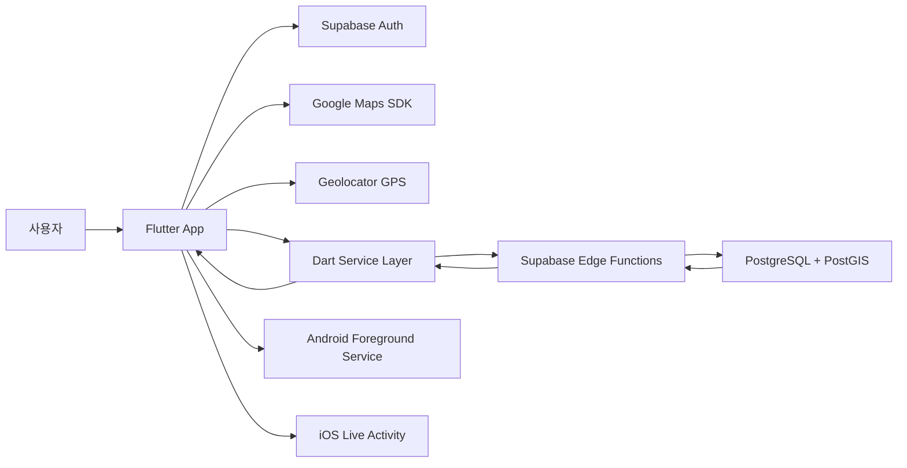
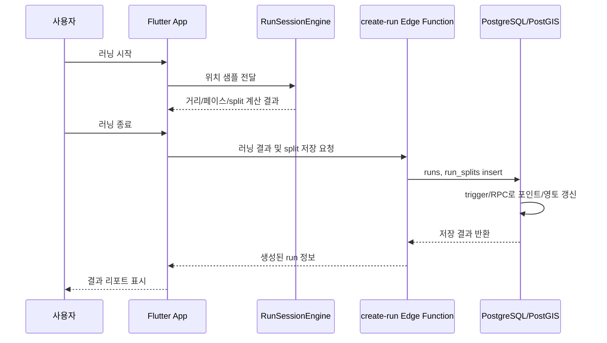
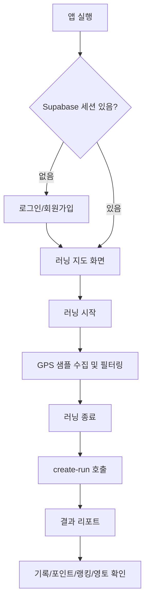

# Runner.io

GPS 러닝 기록을 기반으로 이동 경로, 운동 지표, 포인트, 랭킹, 개인 영토를 제공하는 Flutter 기반 러닝 게임화 애플리케이션입니다.

이 저장소는 Flutter 클라이언트, Android/iOS 네이티브 백그라운드 보조 코드, Supabase PostgreSQL/PostGIS 기반 백엔드 스키마, Supabase Edge Functions를 함께 포함합니다. 문서 내용은 실제 코드 구조와 `docs/` 폴더의 중간보고서 및 구조/테스트 문서를 기준으로 작성했습니다.

## 1. 프로젝트 개요

### 한 줄 소개

`Runner.io`는 러닝을 단순 기록이 아니라 지도 위의 경로, 포인트, 랭킹, 영토 점령으로 연결해 지속적인 운동 동기를 제공하는 모바일 애플리케이션입니다.

### 프로젝트 배경

중간보고서에서는 코로나19 이후 개인 운동 문화가 확산되고 러닝 인구가 증가했지만, 기존 러닝 앱은 거리, 시간, 페이스 같은 기록 확인에 집중되어 반복 사용 동기가 약해질 수 있다는 문제를 제시합니다. 본 프로젝트는 이 한계를 줄이기 위해 GPS 기반 러닝 기록에 게임화 요소를 결합했습니다.

### 해결하고자 하는 문제

- 러닝 기록 앱이 단순 측정과 통계 제공에 머물러 사용자의 장기 참여를 유지하기 어려운 문제
- 운동 결과가 숫자 위주로 표현되어 성취감과 경쟁 요소가 부족한 문제
- 러닝, 기록 조회, 포인트, 랭킹, 영토 정보를 하나의 흐름으로 확인하기 어려운 문제

### 핵심 목표

- GPS 기반 실시간 러닝 기록과 지도 시각화 구현
- 러닝 경로를 활용한 영토 점령 및 포인트 시스템 구현
- 기록, 결과 리포트, 포인트 이력, 랭킹, 마이페이지를 연결한 통합 사용자 흐름 제공
- 졸업작품 시연과 공개 저장소 설명에 적합한 수준의 구조화된 앱/백엔드 구성 확보

## 2. 주요 기능

아래 기능은 코드에서 확인되는 구현 기준으로 정리했습니다. 보고서에 계획으로 언급되었지만 코드에서 확인되지 않은 기능은 별도 진행 현황에 구분했습니다.

| 구분 | 구현 내용 | 관련 위치 |
|---|---|---|
| 인증 | 이메일/비밀번호 회원가입, 로그인, 로그아웃, 앱 시작 시 세션 확인 | `lib/login/`, `lib/services/auth_service.dart`, `lib/main.dart` |
| 메인 러닝 지도 | Google Maps 기반 현재 위치 표시, 러닝 경로 폴리라인, 영토 폴리곤/마커 표시 | `lib/main/running_map_page.dart` |
| 러닝 세션 | 시작, 카운트다운, 일시정지, 재개, 종료, 취소, 거리/속도/페이스/고도/split 계산 | `lib/main/run_session_engine.dart` |
| 결과 리포트 | 거리, 시간, 평균 페이스, 포인트, 칼로리, 상승고도, 점령 면적, 지도 경로, split 표시 | `lib/main/run_result_page.dart` |
| 러닝 기록 | 저장된 러닝 기록 조회 및 상세 결과 화면 이동 | `lib/main/run_history_page.dart`, `supabase/functions/run-history/` |
| 분석 | 주간/월간/전체 요약, 최근 7일 거리 그래프, 이전 기간 대비 거리 변화, 개인 최고 기록 표시 | `lib/main/statistics_page.dart`, `lib/services/statistics_service.dart` |
| 포인트 이력 | 기간별 포인트 변동 내역 조회, 러닝 결과와 연결 | `lib/main/point_history_page.dart`, `supabase/functions/point-history/` |
| 랭킹 | 일/주/월/년/전체 기준 랭킹, 내 주변 순위 표시 | `lib/main/ranking_page.dart`, `supabase/functions/profile-leaderboard/` |
| 영토 | PostGIS 기반 영토 geometry 저장/병합/차감, 지도 표시용 GeoJSON 조회 | `supabase/migrations/`, `supabase/functions/territory-geojson/` |
| 프로필 | 닉네임, 색상, 키, 몸무게, 비밀번호 수정, 프로필 요약 조회 | `lib/main/profile_edit_page.dart`, `supabase/functions/update-profile/` |
| Android 백그라운드 | foreground service, 알림/잠금화면 action, 위치 추적 보조 | `android/app/src/main/kotlin/...` |
| iOS Live Activity | ActivityKit Live Activity, Dynamic Island/잠금화면 상태 표시, HealthKit workout session 보조 | `ios/Runner/`, `ios/Runner/RunWidgetExtension/` |

### 사용자 흐름 기준 설명

1. 사용자는 회원가입 또는 로그인 후 메인 러닝 지도 화면으로 이동합니다.
2. 앱은 현재 위치 권한을 확인하고 지도에 현재 위치, 주변 영토, 사용자 요약 정보를 표시합니다.
3. 사용자가 러닝을 시작하면 위치 샘플이 누적되고 `RunSessionEngine`이 거리, 페이스, 속도, 고도, split을 계산합니다.
4. 러닝 종료 시 클라이언트가 `create-run` Edge Function으로 결과를 저장합니다.
5. Supabase DB trigger/RPC가 러닝 기록, 포인트 이력, 일별 포인트, 영토 정보를 갱신합니다.
6. 사용자는 결과 리포트, 기록, 분석, 포인트 이력, 랭킹, 영토 상세에서 저장된 결과와 성장 추이를 확인합니다.

## 3. 기술 스택

| 영역 | 기술 | 사용 이유 |
|---|---|---|
| Frontend | Flutter, Dart, Material 3 | Android/iOS 중심의 크로스 플랫폼 UI를 빠르게 구현하고 화면 간 상태와 네트워크 로직을 통합하기 위해 사용 |
| Map/Location | `google_maps_flutter`, `geolocator` | 현재 위치, 러닝 경로, 영토 시각화와 GPS 기반 거리/속도 계산을 위해 사용 |
| Voice/Background | `flutter_tts`, `flutter_foreground_task` | 러닝 중 음성 안내와 Android 백그라운드 실행 보조를 위해 사용 |
| Backend | Supabase Auth, Supabase Edge Functions | 인증, API, 서버 측 비즈니스 로직을 제한된 개발 기간 안에 통합하기 위해 사용 |
| Database | PostgreSQL, PostGIS | 러닝 기록, 포인트, 프로필, 공간 geometry와 영토 연산을 처리하기 위해 사용 |
| Native Android | Kotlin, Foreground Service, Notification Action | 앱이 전면에 없을 때도 러닝 상태를 유지하고 알림에서 제어하기 위해 사용 |
| Native iOS | Swift, ActivityKit, Widget Extension, HealthKit | Live Activity 및 잠금화면/Dynamic Island 상태 표시를 위해 사용 |
| Test | `flutter_test`, `integration_test` | 러닝 엔진, 화면 렌더링, Supabase API/DB 흐름 검증을 위해 사용 |
| Tools | Supabase CLI, Flutter SDK, Swift icon script | 로컬 백엔드 실행, 앱 빌드, 아이콘 리소스 생성을 위해 사용 |

## 4. 시스템 아키텍처

### 전체 구조

Flutter 앱은 화면 계층과 서비스 계층으로 나뉘며, 서비스 계층이 Supabase Auth 및 Edge Functions를 호출합니다. 러닝 저장 이후의 포인트/영토 처리는 Edge Function과 PostgreSQL trigger/RPC가 담당합니다. Android/iOS 네이티브 코드는 러닝 중 백그라운드 상태 표시와 제어를 보조합니다.



### 데이터 흐름



### 주요 기능 흐름도



## 5. 프로젝트 폴더 구조

```text
runner_flutter/
  lib/                    Flutter 앱 Dart 소스
    login/                로그인/회원가입 화면
    main/                 러닝 지도, 결과, 기록, 랭킹, 프로필 화면과 러닝 엔진
    services/             Supabase Auth/Edge Function 호출 계층
  supabase/               Supabase 로컬 설정, DB migration, Edge Functions
    functions/            Deno 기반 API 함수
    migrations/           PostgreSQL/PostGIS schema, trigger, RPC
  android/                Android runner 및 foreground service 연동
  ios/                    iOS runner, Live Activity, Widget Extension 연동
  web/                    Flutter Web shell, manifest, icon
  macos/ linux/ windows/  Flutter desktop target runner
  test/                   단위/widget 테스트
  integration_test/       Supabase API/DB E2E 테스트
  docs/                   보고서, 구조 문서, 테스트 계획/결과
  assets/                 앱 아이콘 원본 등 정적 리소스
  tools/                  보조 스크립트
```

자세한 폴더별 설명은 각 폴더의 `README.md`를 참고하세요.

## 6. 실행 방법

### 사전 준비

- Flutter SDK `^3.11.1` 호환 환경
- Android Studio 또는 Xcode
- Supabase CLI
- Google Maps API Key

### 의존성 설치

```bash
flutter pub get
```

### 환경 변수 및 키 설정

Flutter 앱은 Supabase URL과 anon key를 `--dart-define`으로 주입합니다. 값은 Git에 커밋하지 않고 로컬 shell, CI secret, 배포 설정에서 관리합니다.

```bash
export SUPABASE_URL="https://<project-ref>.supabase.co"
export SUPABASE_ANON_KEY="<supabase-anon-key>"
```

Google Maps API key는 Git에 커밋하지 않습니다.

Android:

```properties
# android/local.properties
GOOGLE_MAPS_API_KEY=your-android-restricted-key
```

iOS:

```xcconfig
GOOGLE_MAPS_API_KEY = your-ios-restricted-key
```

Supabase Edge Functions는 다음 환경 변수를 기대합니다.

```text
SUPABASE_URL
SUPABASE_ANON_KEY
SUPABASE_SERVICE_ROLE_KEY
```

`SUPABASE_SERVICE_ROLE_KEY`는 서버 측 함수에서만 사용해야 하며 앱 코드나 공개 문서 예시에 실제 값을 넣지 않습니다.

### 앱 실행

```bash
flutter run \
  --dart-define=SUPABASE_URL="$SUPABASE_URL" \
  --dart-define=SUPABASE_ANON_KEY="$SUPABASE_ANON_KEY"
```

대상 기기를 지정하려면:

```bash
flutter devices
flutter run -d <device-id> \
  --dart-define=SUPABASE_URL="$SUPABASE_URL" \
  --dart-define=SUPABASE_ANON_KEY="$SUPABASE_ANON_KEY"
```

### Supabase 로컬 실행

```bash
supabase start
supabase db reset
supabase functions serve
```

원격 Supabase 프로젝트를 사용 중이면 로컬 DB reset이 원격에 영향을 주지 않도록 CLI 연결 상태를 먼저 확인하세요.

### 정적 분석 및 테스트

```bash
flutter analyze
flutter test
```

E2E 테스트:

```bash
flutter test integration_test/runner_api_e2e_test.dart \
  --dart-define=RUNNER_E2E_EMAIL="$RUNNER_E2E_EMAIL" \
  --dart-define=RUNNER_E2E_PASSWORD="$RUNNER_E2E_PASSWORD"
```

`RUNNER_E2E_EMAIL`, `RUNNER_E2E_PASSWORD`를 생략하면 테스트가 새 사용자를 생성할 수 있습니다. 원격 DB에 테스트 데이터가 남을 수 있으므로 전용 테스트 프로젝트 또는 테스트 계정을 권장합니다.

## 7. 핵심 동작 흐름

### 로그인 및 진입

1. `main.dart`가 Flutter binding과 Supabase를 초기화합니다.
2. Supabase 현재 세션을 확인합니다.
3. 세션이 있으면 `RunningMapPage`, 없으면 `LoginPage`를 표시합니다.
4. 회원가입은 `SignupPage`에서 Supabase Auth를 호출하고, 로그인 성공 후 메인 화면으로 이동합니다.

### 러닝 기록 저장

1. 사용자가 `RunningMapPage`에서 러닝을 시작합니다.
2. 위치 stream이 들어오면 `RunSessionEngine`이 정확도, 최소 이동 거리, 비정상 속도, 일시정지 상태를 고려해 샘플을 처리합니다.
3. 누적 거리, 현재 속도, 평균 페이스, 상승고도, split이 계산됩니다.
4. 종료 시 `RunService.createRun()`이 `create-run` Edge Function으로 결과를 전송합니다.
5. Edge Function이 `runs`, `run_splits`에 저장하고 DB trigger가 포인트와 영토를 갱신합니다.
6. 앱은 `RunResultPage`에서 결과를 표시합니다.

### 기록/분석/포인트/랭킹 확인

1. 기록 화면은 `run-history` 함수로 현재 사용자의 러닝 기록과 split을 조회합니다.
2. 분석 화면은 `RunHistoryEntry` 목록을 클라이언트에서 집계해 주간/월간/전체 요약, 최근 7일 거리, 개인 최고 기록을 표시합니다.
3. 포인트 화면은 `point-history` 함수로 기간별 포인트 이벤트를 조회합니다.
4. 랭킹 화면은 `profile-leaderboard` 함수로 기간별 상위 랭킹 또는 내 주변 순위를 조회합니다.
5. 지도 화면은 `territory-geojson` 함수로 지도 bbox 안의 영토 GeoJSON을 조회합니다.

## 8. 데이터베이스 구조

DB 구조는 `supabase/migrations/20260523142500_initial_remote_schema.sql` 및 추가 migration을 기준으로 정리했습니다.

| 테이블 | 주요 필드 | 역할 |
|---|---|---|
| `profiles` | `user_id`, `nick_name`, `total_points`, `color_hex`, `height_cm`, `weight_kg` | 사용자 프로필, 신체 정보, 누적 포인트, 랭킹 기본 데이터 |
| `runs` | `id`, `started_at`, `ended_at`, `duration`, `distance`, `path_geom`, `loop_geom`, `point`, `avg_pace`, `calories`, `area`, `user_id` | 러닝 단위 기록과 경로 geometry 저장 |
| `run_splits` | `run_id`, `split_index`, `distance_m`, `duration_s`, `avg_pace_s_per_km`, `avg_speed_mps`, `ascent_m`, `calories`, `path_geom` | km 등 구간 단위 분석 데이터 저장 |
| `point_history` | `event_type`, `points_delta`, `created_at`, `user_id` | 러닝 완료, 영토 포인트 등 포인트 이벤트 로그 |
| `territories` | `geom`, `area`, `base_point`, `created_at`, `updated_at`, `user_id`, `next_process_at` | 사용자별 점령 영토 geometry와 유지 포인트 계산 기준 |
| `user_point_daily` | `user_id`, `day_kst`, `run_points`, `territory_points`, `other_points`, `total_points` | KST 기준 일별 포인트 집계 및 기간 랭킹 계산 |

주요 DB 함수/trigger:

- `process_run_geometry`: 러닝 경로 geometry를 기반으로 loop/area/territory 처리를 수행합니다.
- `upsert_or_merge_territory`: 같은 사용자의 영토를 생성하거나 병합합니다.
- `subtract_territory_and_update`: 다른 사용자의 영토와 겹치는 영역을 차감합니다.
- `handle_run_points`: 러닝 생성 시 포인트 이력, 프로필 총점, 일별 포인트를 갱신합니다.
- `apply_territory_worker`, `apply_territory_points`: 처리 시각이 된 영토 유지 포인트를 반영합니다.
- `get_territories_geojson`: 지도 bbox 기준으로 표시할 영토 GeoJSON 데이터를 반환합니다.
- `get_user_info`, `get_profile_rank_count`: 프로필 요약과 순위 조회에 사용됩니다.

## 9. API 구조

클라이언트는 `lib/services/supabase_api.dart`의 공통 URL/header/JSON 처리 함수를 통해 Edge Function을 호출합니다.

| Edge Function | Method | 인증 | 주요 요청 | 주요 응답/효과 |
|---|---|---|---|---|
| `create-run` | `POST` | Bearer access token | `started_at`, `ended_at`, `duration`, `distance`, `point`, `path_geom`, `avg_pace`, `calories`, `splits` | `runs` row 생성, split 저장, 포인트/영토 trigger 유도 |
| `run-history` | `GET` | Bearer access token | `limit`, `offset` | 현재 사용자의 러닝 기록과 split 목록 |
| `point-history` | `GET` | Bearer access token | `range_type`, `anchor_date`, `limit`, `offset` | 기간별 포인트 이력 |
| `profile-leaderboard` | `GET` | Bearer access token | `mode`, `range_type`, `anchor_date`, `user_id` | 상위 랭킹 또는 내 주변 랭킹 |
| `user-ranking` | `GET` | Bearer access token | 없음 | 현재 사용자 프로필, 총점, 순위 요약 |
| `update-profile` | `POST` | Bearer access token | `nick_name`, `color_hex`, `height_cm`, `weight_kg`, `password` | 프로필 또는 비밀번호 수정 |
| `territory-geojson` | `GET` | API key/authorization header | `bbox`, `srid`, `limit` | 지도 표시용 영토 FeatureCollection |

외부 API/SDK:

- Google Maps SDK: 지도 표시, 경로/영토 overlay 렌더링
- Geolocator: 위치 권한, 현재 위치, 위치 stream 수집
- Supabase Auth: 회원가입, 로그인, 세션 관리

## 10. 테스트 및 검증

### 자동 테스트

| 위치 | 검증 내용 |
|---|---|
| `test/run_session_engine_test.dart` | 위치 샘플 처리, 거리 계산, 일시정지/재개, 비정상 샘플 거부 |
| `test/statistics_service_test.dart` | 기간별 통계 집계, 평균 페이스, 최근 7일 거리, 개인 최고 기록 계산 |
| `test/*_page_test.dart` | 로그인, 회원가입, 지도, 결과, 기록, 포인트, 랭킹, 프로필 화면의 기본 렌더링/상태 |
| `integration_test/runner_api_e2e_test.dart` | Supabase Auth, `create-run`, `run-history`, `point-history`, `user_point_daily`, `profile-leaderboard` 연동 |

### 수동 테스트 시나리오

- 신규 사용자 회원가입 후 로그인되는지 확인
- 위치 권한 허용/거부 상태에서 지도 화면 동작 확인
- 러닝 시작, 일시정지, 재개, 종료 후 결과 저장 확인
- 결과 화면에서 거리, 시간, 페이스, 포인트, split, 지도 경로 확인
- 기록 화면에서 저장된 러닝을 다시 열 수 있는지 확인
- 분석 화면에서 주간/월간/전체 요약, 최근 7일 그래프, 개인 최고 기록이 표시되는지 확인
- 포인트 이력과 랭킹이 저장 결과를 반영하는지 확인
- Android 실제 기기에서 foreground service, 알림 action, 백그라운드 위치 추적 확인
- iOS 실제 기기에서 Live Activity, Dynamic Island, 위치 권한 흐름 확인

## 11. 프로젝트 진행 현황

### 구현 완료로 확인되는 기능

- 이메일/비밀번호 기반 회원가입, 로그인, 로그아웃
- Supabase 초기화 및 세션 기반 첫 화면 분기
- Google Maps 기반 지도 화면과 위치 추적
- 러닝 세션 상태 관리 및 거리/페이스/split/고도 계산
- 러닝 결과 저장 및 결과 리포트 표시
- 러닝 기록, 포인트 이력, 랭킹, 프로필 수정 화면
- 러닝 기록 기반 분석 화면과 개인 최고 기록/최근 거리 그래프
- Supabase Edge Functions를 통한 API 계층
- PostgreSQL/PostGIS 기반 러닝/영토/포인트 데이터 구조
- Android foreground service 및 iOS Live Activity 관련 네이티브 코드
- 단위/widget 테스트 및 Supabase E2E 테스트 파일

### 부분 구현 또는 추가 검증이 필요한 기능

- 백그라운드 위치 추적과 잠금화면 제어는 네이티브 코드가 있으나 실제 기기별 권한/배터리 정책 검증이 필요합니다.
- 기간 필터 로직은 보고서에서 통일 필요 사항으로 언급되어 있으며, 화면별 동작 일관성 검증이 필요합니다.
- 네트워크 불안정 상태에서의 오류 메시지, 재시도 UX는 개선 과제로 언급되어 있습니다.
- 위치 정확도가 낮은 환경, 터널, 고층 건물 밀집 지역에서 GPS 필터링 튜닝이 필요합니다.

### 향후 개선 예정 또는 계획 단계 기능

- AI Chatbot API 연동을 통한 러닝 데이터 해석 및 개인화 피드백
- 사용자 피드백 수집을 위한 최종 데모 배포
- 서비스 계층 단위 테스트 확대
- API naming/response schema 표준화
- 배터리 사용량 측정 및 지도 렌더링 성능 점검
- 소셜 기능과 기록 공유 기능은 보고서에서 검토 가능 항목으로 언급되었으나 현재 코드 구현은 확인되지 않습니다.

## 12. 졸업작품으로서의 의의

### 차별점

- 단순 러닝 기록 앱이 아니라 GPS 경로를 영토, 포인트, 랭킹과 연결해 게임화된 운동 경험을 제공합니다.
- Flutter 앱, Supabase Auth/Database/Edge Functions, PostGIS 공간 연산, Android/iOS 네이티브 기능을 통합한 풀스택 모바일 프로젝트입니다.
- 러닝 시작부터 결과 리포트, 기록 조회, 포인트/랭킹 확인까지 하나의 사용자 흐름으로 연결되어 있습니다.

### 기대 효과

- 사용자는 숫자 기록뿐 아니라 지도 위의 시각적 성과와 경쟁 요소를 통해 운동 동기를 얻을 수 있습니다.
- 개발 측면에서는 위치 기반 서비스, 공간 DB, 인증, API, 네이티브 백그라운드 기능을 통합한 실무형 경험을 제공합니다.
- 향후 챌린지, 지역 이벤트, 소셜 비교, 개인화 분석으로 확장할 수 있는 기반을 갖습니다.

### 활용 가능성

- 개인 러닝 습관 형성 앱
- 학교/동아리/지역 커뮤니티 기반 러닝 챌린지
- 위치 기반 게임화 서비스의 학습 및 실험 프로젝트
- PostGIS 기반 이동 경로/영역 처리 예제 프로젝트

## 13. 참고 문서

| 문서 | 반영 내용 |
|---|---|
| `docs/simple_patches/졸작_중간보고서.docx` | 프로젝트 배경, 목표, 기술 선택 이유, 구현 현황, 화면별 진행 내역, 향후 계획 |
| `docs/simple_patches/final_midterm_report_en.docx` | 중간보고서 영문 번역 내용, 기능/테스트/개선 계획 교차 확인 |
| `docs/simple_patches/final_midterm_report_en.txt` | 문서 내용을 텍스트로 확인하여 README 반영 |
| `docs/simple_patches/PROJECT_STRUCTURE.md` | 실제 저장소 구조, 앱/백엔드/네이티브 구성, 데이터 흐름 |
| `docs/simple_patches/test_plan_and_results.md` | 테스트 계획, 검증 대상, E2E 확인 항목 |
| `docs/bug_fixes/` | 앱 복귀 대시보드 데이터 미표시, iOS 화면 잠금 TTS 미출력 등 이슈별 원인 분석과 수정/검증 기록 |
| `docs/simple_patches/PRE_GIT_CHECKLIST.md` | 공개 저장소 업로드 전 키/생성 파일/검증 명령 주의사항 |
