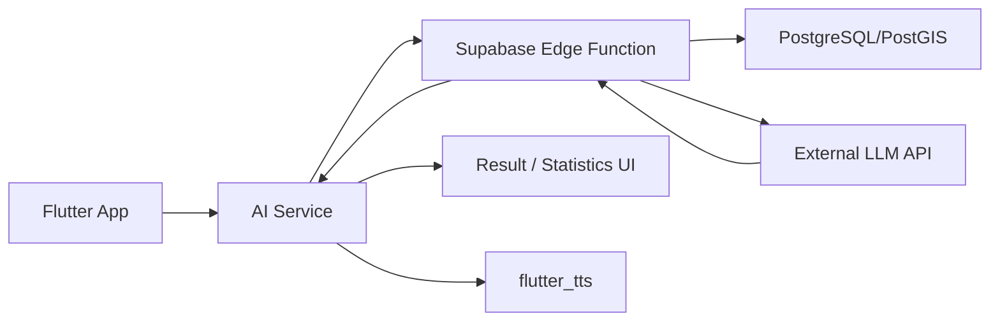
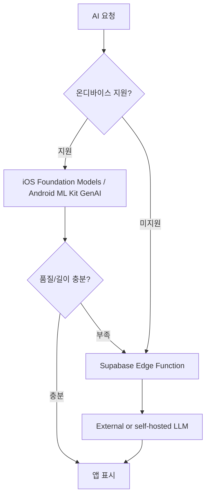

# Runner.io AI 기능 도입 조사 보고서

작성일: 2026-05-24  
대상 프로젝트: `/Users/yw0410/Desktop/Project/runner_flutter`

## 1. 요약

현재 Runner.io는 GPS 러닝 기록, 지도 경로, split, 포인트, 랭킹, 영토 점령, 프로필 데이터를 이미 수집하고 있다. 따라서 AI 기능은 모델이 “새 데이터를 만들어내는” 방향보다 기존 러닝 데이터를 해석하고 사용자에게 다음 행동을 제안하는 방향이 구현 효율과 시연 효과가 가장 좋다.

우선순위는 다음 순서가 적합하다.

| 우선순위 | 기능 | 추천 구현 방식 | 구현 난이도 | 효과 |
|---|---|---|---|---|
| 1 | 러닝 종료 AI 리포트 | Supabase Edge Function + 외부 LLM API | 중 | 결과 화면의 체감 가치가 큼 |
| 2 | 주간/월간 AI 코치 요약 | Edge Function + DB 집계 + LLM | 중 | 기존 분석 화면과 자연스럽게 연결 |
| 3 | 자연어 기록 질의 | Edge Function + 구조화 SQL 조회, 필요 시 RAG | 중상 | “지난달 최고 페이스 알려줘” 같은 챗봇형 기능 |
| 4 | 러닝 중 음성 코칭 문구 생성 | 사전 생성형 LLM + 기존 `flutter_tts` 재생 | 중상 | 현재 TTS 코드와 잘 맞음 |
| 5 | 온디바이스 짧은 요약/문구 생성 | iOS Foundation Models, Android ML Kit GenAI Prompt API | 상 | 개인정보/오프라인 장점, 단 기기 제약 큼 |

가장 현실적인 MVP는 `ai-run-summary` Edge Function을 새로 만들고, `RunResultPage`에서 러닝 저장 후 해당 함수를 호출해 3-5문장 요약, 페이스 평가, 다음 러닝 목표를 보여주는 방식이다.

## 2. 현재 프로젝트에서 AI를 붙이기 좋은 지점

### 2.1 결과 리포트

관련 위치:

- `lib/main/run_result_page.dart`
- `lib/services/run_service.dart`
- `supabase/functions/create-run/index.ts`
- `public.runs`, `public.run_splits`

현재 `create-run` 함수는 러닝 종료 시 `runs`와 `run_splits`를 저장하고, 거리/시간/페이스/칼로리/경로/포인트 데이터를 갖는다. 이 데이터는 AI 요약에 바로 사용할 수 있다.

추천 기능:

- “오늘 러닝 한 줄 평가”
- 페이스 안정성, split 후반 저하 여부, 상승고도 영향 설명
- 다음 러닝 목표 제안
- 점령 면적/포인트/영토 획득을 게임화된 문장으로 설명

구현 방식:

1. `supabase/functions/ai-run-summary/index.ts` 추가
2. 클라이언트는 `run_id`만 전달
3. Edge Function이 JWT 검증 후 해당 사용자의 run/splits/profile 조회
4. LLM에는 원시 GPS 전체가 아니라 집계값, split 요약, 최근 3-5회 기록만 전달
5. JSON 형태로 `{title, summary, insights, next_goal, tts_script}` 반환

평가: 구현 가능성 높음. 현재 Supabase API 공통 계층이 `getFunctionJson`, `postFunctionJson` 형태로 정리되어 있어 새 서비스 파일만 추가하면 된다.

### 2.2 분석 화면 AI 코치

관련 위치:

- `lib/main/statistics_page.dart`
- `lib/services/statistics_service.dart`
- `lib/services/run_history_service.dart`

`StatisticsService`는 이미 주/월/전체 필터, 총 거리, 총 시간, 평균 페이스, 최근 7일 거리, 개인 최고 기록, 이전 기간 대비 변화율을 계산한다. 이 결과를 LLM에 넣으면 “숫자 설명”을 자연어 코칭으로 바꿀 수 있다.

추천 기능:

- 주간 회고: “이번 주는 지난주보다 거리 증가, 페이스는 안정”
- 목표 제안: “다음 주 3회, 총 8km 목표”
- 과훈련 경고: “최근 기록만 기준으로 한 일반 안내” 수준으로 제한
- 성취 배지 추천: 기존 `achievement_service.dart`와 연결

구현 방식:

- 클라이언트에서 이미 계산된 `StatisticsSummary`를 서버에 보내는 방식은 빠르지만 조작 가능성이 있다.
- 더 안전한 방식은 Edge Function이 `run-history`와 같은 방식으로 서버에서 기록을 조회해 집계한 뒤 LLM을 호출하는 것이다.

평가: 구현 가능성 높음. 졸업작품 시연에서는 가장 설명하기 좋은 기능이다.

### 2.3 자연어 기록 질의

관련 위치:

- `lib/main/run_history_page.dart`
- `lib/main/statistics_page.dart`
- `supabase/functions/run-history/index.ts`
- `supabase/functions/profile-leaderboard/index.ts`

추천 질의 예시:

- “지난달 가장 긴 러닝은?”
- “내 최고 페이스 기록이 언제야?”
- “최근 7일 동안 얼마나 뛰었어?”
- “이번 달 랭킹 올리려면 몇 포인트가 더 필요해?”
- “내 영토가 가장 많이 늘어난 날은?”

구현 방식:

- 1단계: LLM이 직접 SQL을 만들지 않게 하고, 서버가 허용한 tool/RPC만 실행한다.
- 2단계: `get_user_runs`, `get_user_stats`, `get_rank_context`, `get_territory_summary` 같은 제한된 내부 함수로만 조회한다.
- 3단계: LLM은 조회 결과를 한국어 답변으로 요약한다.

평가: 구현 가능성 중상. 기능은 매력적이지만 권한/쿼리 안전 설계가 필요하다.

### 2.4 러닝 중 음성 코칭

관련 위치:

- `lib/main/running_map_page.dart`
- `flutter_tts`
- Android foreground service
- iOS Live Activity

현재 앱은 `flutter_tts`를 사용하고 러닝 중 split 안내를 할 수 있는 구조가 있다. 실시간 LLM 호출은 지연, 비용, 네트워크 문제 때문에 추천하지 않는다. 대신 러닝 시작 전 또는 1km마다 짧은 문구 후보를 미리 생성하고, 실제 러닝 중에는 로컬 조건식으로 선택해 TTS로 읽는 방식이 좋다.

추천 기능:

- 1km마다 “이전 km보다 12초 빨라졌어요” 같은 상황형 코칭
- 목표 페이스 대비 느림/빠름 안내
- 개인 최고 기록 근접 알림
- 영토 점령 가능성이 있을 때 동기부여 문구

평가: 구현 가능성 중상. LLM은 문구 생성 보조로 쓰고, 실시간 판단은 기존 러닝 엔진의 수치 계산으로 처리하는 편이 안정적이다.

### 2.5 영토/랭킹 전략 추천

관련 위치:

- `lib/main/running_map_page.dart`
- `lib/main/territory_detail_page.dart`
- `supabase/functions/territory-geojson/index.ts`
- PostGIS 기반 `territories`

추천 기능:

- 주변 영토 상황 요약
- “짧은 루프 코스 추천” 문구
- 랭킹 상승을 위한 필요 포인트 설명
- 특정 유저의 영토와 내 영토 비교

평가: 구현 가능성 중. 실제 경로 추천까지 가면 지도/도로 네트워크 API가 필요하므로, MVP에서는 “주변 영토와 최근 기록 기반 전략 텍스트”가 적합하다.

## 3. 구현 방식 비교

### 3.1 외부 LLM API

후보:

- OpenAI Responses API
- Google Gemini API
- Anthropic Claude API 등

장점:

- 품질이 가장 안정적이다.
- Flutter 앱에는 API key를 넣지 않고 Supabase Edge Function에서만 secret을 관리할 수 있다.
- 구조화 출력(JSON), 함수 호출, 대화 상태, 파일/검색 도구 같은 고급 기능을 활용할 수 있다.

단점:

- 네트워크와 비용이 필요하다.
- 러닝 기록, 위치 요약, 신체 정보가 외부 API로 전달될 수 있으므로 최소 데이터 전송과 동의 UI가 필요하다.

현재 프로젝트 적용 방식:

```text
Flutter
-> SupabaseApi.postFunctionJson("ai-run-summary")
-> Supabase Edge Function
-> runs/run_splits/profiles 조회
-> LLM API 호출
-> JSON 응답
-> 결과/분석 화면 표시 또는 TTS 재생
```

OpenAI 공식 문서 기준으로 Responses API는 텍스트/이미지 입력과 텍스트/JSON 출력을 지원하고, function calling 및 file search 같은 도구 확장도 제공한다. 이 프로젝트에서는 우선 텍스트 입력과 JSON 출력만으로 충분하다.

### 3.2 Supabase Edge Function + 로컬/자가 호스팅 LLM API

후보:

- Ollama 서버
- Llamafile 서버
- 사내/개인 GPU 서버

장점:

- 운영자가 데이터 위치를 통제할 수 있다.
- OpenAI/Gemini 같은 외부 API 비용을 줄일 수 있다.
- Supabase Edge Function이 이미 Ollama/Llamafile 호스트를 바라보는 구성을 지원한다.

단점:

- GPU 서버 운영, 배포, 모니터링 부담이 생긴다.
- 모바일 앱의 사용량이 늘면 지연시간과 동시성 문제가 커진다.
- 모델 품질과 한국어 코칭 품질은 모델 선택에 크게 좌우된다.

현재 프로젝트 적용 방식:

```text
Flutter
-> Supabase Edge Function
-> AI_INFERENCE_API_HOST
-> Ollama/Llamafile
-> Edge Function에서 응답 후처리
```

평가: 졸업작품 시연이나 개인 배포에서는 가능하지만, 안정적 서비스 운영까지 고려하면 외부 LLM API보다 관리 부담이 크다. 다만 “개인정보 보호형 AI 서버”라는 설명 포인트는 좋다.

### 3.3 스마트폰 내장 LLM 연동

#### iOS: Apple Foundation Models

Apple은 Foundation Models framework로 Apple Intelligence의 온디바이스 대형 언어 모델에 접근할 수 있게 한다. Flutter에서는 Dart에서 직접 쓰기 어렵기 때문에 Swift 네이티브 코드를 만들고 MethodChannel로 호출해야 한다.

적합한 기능:

- 짧은 러닝 요약
- 알림/TTS 문구 생성
- 오프라인 회고 문장
- 개인정보가 민감한 프로필 기반 문구

제약:

- Apple Intelligence 지원 기기와 OS 버전에 의존한다.
- Swift 네이티브 구현과 가용성 체크가 필요하다.
- 모델 성능은 서버 LLM보다 제한적일 수 있다.

구현 흐름:

```text
Flutter AI service
-> MethodChannel("runner_flutter/on_device_ai")
-> iOS Swift FoundationModels wrapper
-> JSON/text 반환
```

#### Android: ML Kit GenAI Prompt API / Gemini Nano

Google 문서 기준으로 기존 Google AI Edge SDK는 deprecated이고, Gemini Nano에 custom prompt를 보내려면 ML Kit GenAI Prompt API 사용이 권장된다. 이 API는 alpha 상태이며 Gemini Nano/AICore 지원 기기 제약이 있다.

적합한 기능:

- 짧은 텍스트 요약
- 러닝 후 한두 문장 코칭
- 오프라인 동기부여 문구
- 이미지+텍스트 입력이 필요한 간단 기능

제약:

- alpha API라 변경 가능성이 있다.
- 모든 Android 기기에서 되는 기능이 아니다.
- Flutter 플러그인 또는 Kotlin MethodChannel 구현이 필요하다.

구현 흐름:

```text
Flutter AI service
-> MethodChannel("runner_flutter/on_device_ai")
-> Android Kotlin ML Kit GenAI Prompt API
-> availability check
-> 지원하지 않으면 Edge Function API로 fallback
```

평가: 온디바이스 AI는 “보조 경로”로 설계해야 한다. 기본값은 서버 API, 지원 기기에서는 온디바이스 우선 또는 개인정보 모드로 제공하는 하이브리드 구성이 좋다.

## 4. RAG 적용 가능성

RAG는 Retrieval-Augmented Generation의 약자로, LLM이 답변하기 전에 관련 데이터를 검색해 그 검색 결과를 근거로 답하게 하는 구조다.

이 프로젝트에는 두 종류의 RAG가 가능하다.

### 4.1 사용자 데이터 기반 RAG

대상 데이터:

- 러닝 기록
- split
- 포인트 이력
- 랭킹
- 영토 변화
- 프로필 목표/신체 정보

하지만 이 데이터는 대부분 구조화된 테이블이다. 따라서 처음부터 vector RAG를 쓰기보다 SQL/RPC 기반 retrieval을 먼저 쓰는 것이 정확하다.

추천 구조:

```text
사용자 질문
-> 의도 분류
-> 허용된 RPC 조회
-> 조회 결과를 LLM에 context로 제공
-> 답변 생성
```

예시:

- 질문: “이번 달 내가 잘한 점 알려줘”
- retrieval: 이번 달 run summary, 이전 달 비교, best record, 포인트 변화
- generation: 코칭 문장 생성

### 4.2 지식 문서 기반 RAG

대상 데이터:

- 러닝 훈련 상식 문서
- 앱 사용법
- 배지/포인트/영토 규칙
- 개인정보/안전 안내

이 경우에는 Supabase `pgvector`를 이용한 vector search가 적합하다. Supabase 문서는 Edge Functions에서 `gte-small` embedding 모델을 내장으로 사용할 수 있고, Postgres `pgvector`로 의미 기반 검색을 구현할 수 있다고 안내한다.

추천 구조:

```text
documents / document_sections 테이블
-> embedding vector 저장
-> match_documents RPC
-> ai-chat Edge Function에서 관련 문서 검색
-> LLM 답변에 근거로 포함
```

주의:

- Supabase 내장 `gte-small`은 영어 중심이고 512 token truncation 제약이 있다. 한국어 러닝 코칭 문서에는 OpenAI/Gemini embedding 또는 다국어 embedding 모델을 검토하는 것이 좋다.
- 사용자 기록 질의는 vector search보다 SQL이 우선이다.
- “건강/부상/의학 조언”은 진단처럼 보이지 않게 안전 문구와 범위를 제한해야 한다.

## 5. 추천 아키텍처

### 5.1 1차 MVP: 서버 AI



구성 요소:

- `lib/services/ai_coach_service.dart`
- `supabase/functions/ai-run-summary/index.ts`
- `supabase/functions/ai-weekly-coach/index.ts`
- 선택: `ai_summaries` 캐시 테이블

캐시 테이블 예시:

```sql
create table public.ai_summaries (
  id bigint generated by default as identity primary key,
  user_id uuid not null references public.profiles(user_id) on delete cascade,
  run_id bigint references public.runs(id) on delete cascade,
  summary_type text not null,
  model text not null,
  input_hash text not null,
  result jsonb not null,
  created_at timestamptz not null default now(),
  unique (user_id, summary_type, input_hash)
);
```

캐시가 필요한 이유:

- 결과 화면을 열 때마다 LLM 비용이 발생하지 않게 한다.
- 같은 러닝 기록에 같은 요약을 안정적으로 보여준다.
- 추후 모델/프롬프트 변경 시 버전 관리가 가능하다.

### 5.2 2차: 하이브리드 AI



이 방식은 개인정보와 오프라인 장점을 살리면서도, 미지원 기기에서는 서버 AI로 안정적인 기능을 제공한다.

## 6. 구체적 기능 제안

### 기능 A. AI 러닝 리포트

사용 화면:

- 러닝 종료 결과 화면
- 기록 상세 화면

입력 데이터:

- 거리, 시간, 평균 페이스, split별 페이스
- 상승고도, 칼로리
- 점령 면적, 포인트
- 최근 3회 러닝 평균

출력:

```json
{
  "title": "후반까지 페이스를 잘 유지한 러닝",
  "summary": "오늘은 3.2km를 안정적으로 완주했고...",
  "insights": [
    "2km 이후 페이스 하락이 작았습니다.",
    "최근 평균보다 거리가 늘었습니다."
  ],
  "next_goal": "다음 러닝은 같은 페이스로 3.5km를 목표로 해보세요.",
  "tts_script": "좋아요. 오늘은 후반 페이스가 안정적이었어요..."
}
```

난이도: 중  
추천도: 매우 높음

### 기능 B. AI 주간 코치

사용 화면:

- `StatisticsPage`
- `MyPage` 요약 카드

출력:

- 이번 주 칭찬
- 페이스/거리 변화 설명
- 다음 주 목표
- 회복 권장 문구

난이도: 중  
추천도: 높음

### 기능 C. AI 기록 검색 챗봇

사용 화면:

- 새 `AiCoachPage`
- 분석 화면 하단 질문 입력

예시 질문:

- “최근 한 달간 내 평균 페이스가 좋아졌어?”
- “포인트를 가장 많이 얻은 러닝은?”
- “내 최고 기록을 깨려면 다음 목표를 어떻게 잡아야 해?”

난이도: 중상  
추천도: 중

### 기능 D. 러닝 중 AI 음성 코치

사용 화면:

- 러닝 지도 화면
- TTS

권장 방식:

- 러닝 시작 전에 목표와 최근 기록으로 문구 세트 생성
- 러닝 중에는 조건식으로 문구 선택
- LLM을 실시간 루프에 넣지 않는다

난이도: 중상  
추천도: 중상

### 기능 E. 영토 전략 코치

사용 화면:

- 지도 화면
- 영토 상세 화면

출력:

- “현재 주변에 내 영토와 가까운 빈 영역이 많습니다.”
- “짧은 루프를 만들면 점령 면적을 늘릴 수 있습니다.”
- “오늘 2km만 더 뛰면 주간 랭킹에서 한 단계 오를 가능성이 있습니다.”

난이도: 중  
추천도: 중

## 7. 보안 및 개인정보 고려사항

1. LLM API key는 Flutter 앱에 넣지 않는다. 현재 프로젝트는 `SupabaseApi`가 Edge Function 호출 구조를 이미 갖고 있으므로, AI provider secret은 Supabase secret으로만 관리한다.
2. 원시 GPS 좌표 전체를 외부 LLM에 보내지 않는다. 필요하면 거리, split, 대략적 지역, 점령 면적 같은 집계값만 보낸다.
3. 키/몸무게 같은 프로필 정보는 칼로리/운동 강도 설명에 필요할 때만 사용하고, 사용 전 안내가 필요하다.
4. 건강 조언은 일반 운동 정보로 제한한다. 부상, 통증, 질병 판단은 전문 의료 상담을 권장해야 한다.
5. AI 응답은 캐시하고 `model`, `prompt_version`, `input_hash`를 저장해 재현성을 확보한다.
6. 랭킹/타인 영토 정보는 이미 공개 가능한 범위와 동일한 데이터만 AI context에 넣는다.

## 8. 단계별 구현 계획

### 1단계: AI 러닝 리포트

작업:

- `supabase/functions/ai-run-summary/index.ts` 추가
- `lib/services/ai_coach_service.dart` 추가
- `RunResultPage`에 AI 리포트 섹션 추가
- LLM 응답 JSON schema 검증
- 실패 시 “AI 리포트를 불러오지 못했습니다” 정도로 조용히 fallback

예상 기간: 1-2일  
테스트: Edge Function 단위 테스트, Flutter widget 테스트, 실제 러닝 기록 3개 샘플 검증

### 2단계: AI 주간 코치

작업:

- `ai-period-summary` Edge Function 추가
- `StatisticsPage`에 주/월/전체 AI 요약 카드 추가
- 캐시 테이블 도입

예상 기간: 1-2일

### 3단계: 자연어 질의

작업:

- 허용 tool/RPC 목록 설계
- 질문 의도 분류 프롬프트 작성
- `ai-chat` Edge Function 추가
- 대화 UI 추가

예상 기간: 3-5일

### 4단계: 온디바이스 실험

작업:

- `OnDeviceAiService` 인터페이스 추가
- iOS Swift MethodChannel 실험
- Android Kotlin ML Kit GenAI Prompt API 실험
- 기기 미지원 fallback 구현

예상 기간: 5일 이상  
주의: 실제 지원 기기 없이는 검증이 제한된다.

## 9. 기술 선택 결론

현재 프로젝트에는 Supabase Edge Functions, 인증 토큰 검증, 서비스 계층이 이미 있으므로 첫 AI 기능은 외부 LLM API를 Edge Function 뒤에 숨기는 방식이 가장 적합하다.

RAG는 바로 도입할 수 있지만, 사용자 러닝 데이터는 구조화 데이터이므로 SQL/RPC retrieval이 우선이다. 벡터 RAG는 앱 사용법, 러닝 코칭 지식, 배지/영토 규칙 설명 같은 문서 기반 답변에 적용하는 것이 좋다.

온디바이스 LLM은 장기적으로 매력적이지만 1차 구현 대상으로는 위험하다. iOS Foundation Models와 Android ML Kit GenAI Prompt API 모두 네이티브 브리지와 기기/OS 가용성 체크가 필요하기 때문이다. 따라서 “서버 AI 기본 + 온디바이스 가능 시 fallback 또는 개인정보 모드”가 가장 균형 잡힌 설계다.

## 10. 참고 자료

- OpenAI Responses API: https://platform.openai.com/docs/api-reference/responses
- OpenAI Text generation guide: https://developers.openai.com/api/docs/guides/text
- Supabase Edge Functions: https://supabase.com/docs/guides/functions
- Supabase Running AI Models in Edge Functions: https://supabase.com/docs/guides/functions/ai-models
- Supabase Semantic Search with pgvector: https://supabase.com/docs/guides/ai/semantic-search
- Supabase Semantic Search Edge Function example: https://supabase.com/docs/guides/functions/examples/semantic-search
- Apple Foundation Models: https://developer.apple.com/documentation/foundationmodels/
- Android Gemini Nano: https://developer.android.com/ai/gemini-nano
- Android ML Kit GenAI APIs: https://developer.android.com/ai/gemini-nano/ml-kit-genai
- ML Kit GenAI Prompt API: https://developers.google.com/ml-kit/genai/prompt/android
